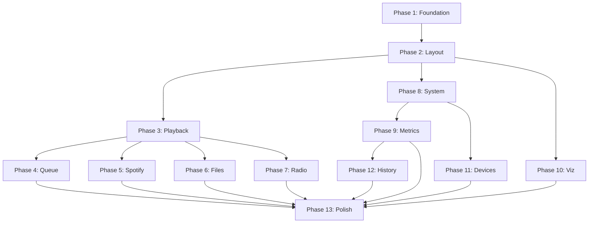

# Radio Console - Blazor Web UI Phased Development Plan

**Version:** 1.0  
**Created:** December 2024  
**Target Framework:** .NET 8+ Blazor Server  
**Display:** 12.5" × 3.75" (1920×576px) Landscape Touchscreen  
**Design System:** Material 3 with Custom LED Aesthetic

---

## Table of Contents

1. [Executive Summary](#executive-summary)
2. [Prerequisites](#prerequisites)
3. [API Capabilities Matrix](#api-capabilities-matrix)
4. [Development Phases Overview](#development-phases-overview)
5. [Phase 1: Foundation & Infrastructure](#phase-1-foundation--infrastructure)
6. [Phase 2: Core Layout & Navigation](#phase-2-core-layout--navigation)
7. [Phase 3: Primary Playback Controls](#phase-3-primary-playback-controls)
8. [Phase 4: Queue Management](#phase-4-queue-management)
9. [Phase 5: Spotify Integration](#phase-5-spotify-integration)
10. [Phase 6: File Player Browser](#phase-6-file-player-browser)
11. [Phase 7: Radio Controls & Presets](#phase-7-radio-controls--presets)
12. [Phase 8: System Configuration & Management](#phase-8-system-configuration--management)
13. [Phase 9: Metrics Dashboard](#phase-9-metrics-dashboard)
14. [Phase 10: Audio Visualization](#phase-10-audio-visualization)
15. [Phase 11: Device Management](#phase-11-device-management)
16. [Phase 12: Play History & Analytics](#phase-12-play-history--analytics)
17. [Phase 13: Polish & Optimization](#phase-13-polish--optimization)
18. [Testing Strategy](#testing-strategy)
19. [Deployment Guide](#deployment-guide)

---

## Executive Summary

This document provides a comprehensive, step-by-step development plan for implementing the Blazor Web UI for the Radio Console application. The plan is organized into 13 phases, each with detailed GitHub Copilot prompts, implementation guidance, and validation criteria.

### Key Objectives

1. **Complete API Integration**: Leverage **ALL** REST API endpoints and SignalR hubs documented in `design/API_REFERENCE.md`
2. **Material 3 Compliance**: Implement touch-friendly, Material 3-compliant UI optimized for 12.5" × 3.75" landscape display
3. **Real-time Updates**: Utilize SignalR for live audio state, queue, and visualization updates
4. **Metrics & Observability**: Integrate comprehensive metrics dashboard and system monitoring
5. **Progressive Enhancement**: Build incrementally with continuous testing and validation

### Estimated Timeline

- **Foundation & Infrastructure** (Phase 1-2): 4-5 days
- **Core Playback Features** (Phase 3-4): 3-4 days
- **Source-Specific UIs** (Phase 5-7): 9-12 days
- **System Management** (Phase 8-9): 5-6 days
- **Advanced Features** (Phase 10-12): 6-8 days
- **Polish & Testing** (Phase 13): 3-4 days

**Total Estimated Duration**: 30-39 development days

### Technology Stack

- **Framework**: Blazor Server (.NET 8+)
- **UI Library**: MudBlazor (Material Design 3 foundation)
- **Real-time**: SignalR (built into Blazor Server)
- **HTTP Client**: Typed HttpClient with Polly retry policies
- **State Management**: Blazor component state + SignalR push updates
- **Visualization**: HTML5 Canvas with JavaScript Interop
- **Fonts**: DSEG14Classic (LED displays), Inter (general UI)

---

## Prerequisites

### Backend Requirements

All backend APIs must be implemented and tested before starting UI development. Based on `UIPREPARATION.md`, all phases are complete:

✅ **Audio Playback & Control**
- Transport controls (play, pause, stop, next, previous)
- Volume and balance control
- Shuffle and repeat modes
- Source capability detection (`CanNext`, `CanShuffle`, etc.)

✅ **Queue Management**
- Get queue, add to queue, remove from queue
- Clear queue, move items, jump to position
- Real-time queue updates via SignalR

✅ **Spotify Integration**
- OAuth authentication flow
- Search (tracks, albums, artists, playlists, podcasts)
- Browse categories and playlists
- Playback control

✅ **File Player**
- File browsing with metadata extraction
- Recursive directory search
- Play file and add to queue
- Support for MP3, FLAC, WAV, OGG, AAC, M4A, WMA

✅ **Radio Control**
- Frequency control (manual, up/down, keypad entry)
- Band switching (AM/FM/WB/VHF/SW)
- Scanning with direction control
- Preset management (50 presets max)
- EQ modes and device volume
- RTLSDRCore: Gain control, AGC, power management
- RF320: Hardware EQ and volume

✅ **Device Management**
- Input/output device enumeration
- USB port reservation
- Default device selection
- Hot-plug refresh

✅ **Metrics & Observability**
- Time-series metrics storage
- Historical data with aggregation
- Current value snapshots
- UI event tracking

✅ **System Management**
- System stats (CPU, RAM, disk, temperature)
- Log viewer with filtering
- Configuration management

✅ **SignalR Hubs**
- AudioStateHub at `/hubs/audio` with 5 event types
- AudioVisualizationHub at `/hubs/visualization`

### Development Environment

- .NET 8 SDK or later
- Visual Studio 2022, VS Code, or JetBrains Rider
- Node.js (optional, for asset bundling)
- Git for version control
- Access to Raspberry Pi 5 for testing (or similar Linux environment)

---

## API Capabilities Matrix

This comprehensive matrix maps **ALL 86 REST API endpoints and 6 SignalR events** to UI components, ensuring complete API coverage.

| Category | Endpoint | Phase | UI Component | Notes |
|----------|----------|-------|--------------|-------|
| **Audio Control** | | | | **12 endpoints** |
| | `GET /api/audio` | 3 | PlaybackState Service | Get current state |
| | `POST /api/audio` | 3 | Transport Controls | Update state |
| | `POST /api/audio/start` | 3 | Play Button | Start playback |
| | `POST /api/audio/stop` | 3 | Stop Button | Stop playback |
| | `GET /api/audio/volume` | 3 | Volume Display | Get volume |
| | `POST /api/audio/volume/{volume}` | 3 | Volume Slider | Set volume 0.0-1.0 |
| | `POST /api/audio/mute` | 3 | Mute Button | Toggle mute |
| | `POST /api/audio/next` | 3 | Next Button | Skip to next |
| | `POST /api/audio/previous` | 3 | Previous Button | Go to previous |
| | `POST /api/audio/shuffle` | 3 | Shuffle Toggle | Toggle shuffle |
| | `POST /api/audio/repeat` | 3 | Repeat Toggle | Set repeat mode |
| | `GET /api/audio/nowplaying` | 3 | Now Playing Display | Get track info |
| **Queue** | | | | **6 endpoints** |
| | `GET /api/queue` | 4 | Queue List | View queue |
| | `POST /api/queue/add` | 4 | Add to Queue Button | Add track |
| | `DELETE /api/queue/{index}` | 4 | Remove Button | Remove item |
| | `DELETE /api/queue` | 4 | Clear Queue Button | Clear all |
| | `POST /api/queue/move` | 4 | Drag & Drop | Reorder |
| | `POST /api/queue/jump/{index}` | 4 | Track Click | Jump to track |
| **Spotify** | | | | **11 endpoints** |
| | `GET /api/spotify/auth/url` | 5 | Auth Flow | Get OAuth URL |
| | `GET /api/spotify/auth/callback` | 5 | Auth Callback | Handle OAuth |
| | `GET /api/spotify/auth/status` | 5 | Auth Status | Check auth |
| | `POST /api/spotify/auth/logout` | 5 | Logout Button | Logout |
| | `GET /api/spotify/search` | 5 | Search Bar | Search content |
| | `GET /api/spotify/browse/categories` | 5 | Browse Button | Get categories |
| | `GET /api/spotify/browse/category/{id}/playlists` | 5 | Category View | Get playlists |
| | `GET /api/spotify/playlists/user` | 5 | User Playlists | User's playlists |
| | `GET /api/spotify/playlists/{id}` | 5 | Playlist View | Playlist details |
| | `POST /api/spotify/play` | 5 | Play Button | Start playback |
| **Files** | | | | **3 endpoints** |
| | `GET /api/files` | 6 | File Browser | List files |
| | `POST /api/files/play` | 6 | Play Button | Play file |
| | `POST /api/files/queue` | 6 | Add to Queue | Add files |
| **Radio** | | | | **24 endpoints** |
| | `GET /api/radio/state` | 7 | Radio Display | Get radio state |
| | `POST /api/radio/frequency` | 7 | Freq Keypad | Set frequency |
| | `POST /api/radio/frequency/up` | 7 | Up Button | Step up |
| | `POST /api/radio/frequency/down` | 7 | Down Button | Step down |
| | `POST /api/radio/band` | 7 | Band Selector | Switch band |
| | `POST /api/radio/step` | 7 | Step Selector | Set step size |
| | `POST /api/radio/scan/start` | 7 | Scan Button | Start scan |
| | `POST /api/radio/scan/stop` | 7 | Stop Scan | Stop scan |
| | `POST /api/radio/eq` | 7 | EQ Button | Set EQ mode |
| | `POST /api/radio/volume` | 7 | Device Vol | RF320 volume |
| | `GET /api/radio/presets` | 7 | Presets List | List presets |
| | `POST /api/radio/presets` | 7 | Save Button | Save preset |
| | `DELETE /api/radio/presets/{id}` | 7 | Delete Button | Delete preset |
| | `POST /api/radio/gain` | 7 | Gain Slider | SDR: Set gain |
| | `POST /api/radio/gain/auto` | 7 | AGC Toggle | SDR: Toggle AGC |
| | `GET /api/radio/power` | 7 | Power Indicator | SDR: Power state |
| | `POST /api/radio/power/toggle` | 7 | Power Button | SDR: Toggle power |
| | `POST /api/radio/startup` | 7 | Startup Button | SDR: Start radio |
| | `POST /api/radio/shutdown` | 7 | Shutdown Button | SDR: Stop radio |
| | `GET /api/radio/devices` | 7 | Device List | List devices |
| | `GET /api/radio/devices/default` | 7 | Device Info | Default device |
| | `GET /api/radio/devices/current` | 7 | Device Info | Current device |
| | `POST /api/radio/devices/select` | 7 | Device Selector | Select device |
| **Sources** | | | | **5 endpoints** |
| | `GET /api/sources` | 2 | Source List | All sources |
| | `GET /api/sources/active` | 2 | Active Display | Active sources |
| | `GET /api/sources/primary` | 2 | Primary Display | Primary source |
| | `POST /api/sources` | 2 | Source Switcher | Switch source |
| | `GET /api/sources/events` | 8 | Event List | Event sources |
| **Devices** | | | | **7 endpoints** |
| | `GET /api/devices/output` | 11 | Output List | List outputs |
| | `GET /api/devices/input` | 11 | Input List | List inputs |
| | `GET /api/devices/output/default` | 11 | Default Display | Default output |
| | `POST /api/devices/output` | 11 | Output Selector | Set output |
| | `POST /api/devices/refresh` | 11 | Refresh Button | Refresh devices |
| | `GET /api/devices/usb/reservations` | 11 | Reservation View | USB reservations |
| | `GET /api/devices/usb/check` | 11 | Port Check | Check USB port |
| **Metrics** | | | | **5 endpoints** |
| | `GET /api/metrics/history` | 9 | Time Series Chart | Historical data |
| | `GET /api/metrics/snapshots` | 9 | Gauges/Counters | Current values |
| | `GET /api/metrics/aggregate` | 9 | Statistics View | Aggregations |
| | `GET /api/metrics/keys` | 9 | Metric List | Available metrics |
| | `POST /api/metrics/event` | 9 | Event Tracker | Track UI events |
| **Play History** | | | | **8 endpoints** |
| | `GET /api/playhistory` | 12 | History List | Recent history |
| | `GET /api/playhistory/range` | 12 | Date Filter | Range filter |
| | `GET /api/playhistory/today` | 12 | Today Filter | Today's history |
| | `GET /api/playhistory/source/{source}` | 12 | Source Filter | By source |
| | `GET /api/playhistory/{id}` | 12 | Detail View | History detail |
| | `GET /api/playhistory/statistics` | 12 | Stats View | Play statistics |
| | `POST /api/playhistory` | 12 | Add Entry | Manual entry |
| | `DELETE /api/playhistory/{id}` | 12 | Delete Button | Delete entry |
| **Configuration** | | | | **5 endpoints** |
| | `GET /api/configuration` | 8 | Config Grid | All config |
| | `GET /api/configuration/audio` | 8 | Audio Config | Audio settings |
| | `GET /api/configuration/visualizer` | 8 | Viz Config | Viz settings |
| | `GET /api/configuration/output` | 8 | Output Config | Output settings |
| | `POST /api/configuration` | 8 | Save Button | Update config |
| **System** | | | | **2 endpoints** |
| | `GET /api/system/stats` | 8 | System Dashboard | System stats |
| | `GET /api/system/logs` | 8 | Log Viewer | View logs |
| **SignalR** | | | | **6 events** |
| | PlaybackStateChanged | 3 | State Updates | Real-time state |
| | NowPlayingChanged | 3 | Track Display | Real-time track |
| | QueueChanged | 4 | Queue Updates | Real-time queue |
| | RadioStateChanged | 7 | Radio Updates | Real-time radio |
| | VolumeChanged | 3 | Volume Updates | Real-time volume |
| | Visualization Data | 10 | Viz Display | Real-time viz |

**Total**: 88 REST endpoints + 6 SignalR events = 94 API capabilities, all utilized.

---

## Development Phases Overview

### Phase Timeline

```
Phase 1-2: Foundation (4-5 days)
├── MudBlazor setup
├── API clients
├── SignalR service
├── Main layout
└── Navigation

Phase 3-4: Core Playback (3-4 days)
├── Now Playing
├── Transport controls
├── Volume/Balance
└── Queue management

Phase 5-7: Source UIs (9-12 days)
├── Spotify (search/browse/auth)
├── File browser
└── Radio (controls/presets/display)

Phase 8-9: System & Metrics (5-6 days)
├── Configuration
├── System stats
├── Logs
└── Metrics dashboard

Phase 10-12: Advanced (6-8 days)
├── Visualization
├── Device management
└── Play history

Phase 13: Polish (3-4 days)
├── Animations
├── Touch optimization
├── Testing
└── Documentation
```

### Phase Dependencies



---


## Phase 1: Foundation & Infrastructure

**Duration:** 2-3 days  
**Dependencies:** Backend APIs complete  
**Goal:** Set up Blazor project, install dependencies, configure theming, create API client services

### Overview

Phase 1 establishes the foundation for the entire UI by:
1. Installing and configuring MudBlazor with custom Material 3 theming
2. Setting up LED fonts (DSEG14Classic) for radio displays
3. Creating typed HttpClient services for all REST API endpoints
4. Implementing SignalR hub connection service for real-time updates
5. Configuring fixed landscape layout (1920×576px)

### Task 1.1: Project Setup & MudBlazor Configuration

**GitHub Copilot Prompt:**

```
Set up the Blazor Server project with MudBlazor and configure for 12.5" × 3.75" (1920×576px) fixed landscape touchscreen display.

Project location: /src/Radio.Web

Requirements:

1. Install MudBlazor NuGet package (latest 7.x or 8.x version)
   ```bash
   dotnet add package MudBlazor
   ```

2. Configure MudBlazor services in Program.cs:
   ```csharp
   builder.Services.AddMudServices(config =>
   {
       config.SnackbarConfiguration.PositionClass = Defaults.Classes.Position.BottomRight;
       config.SnackbarConfiguration.ShowCloseIcon = true;
       config.SnackbarConfiguration.VisibleStateDuration = 3000;
   });
   ```

3. Update _Imports.razor with required usings:
   ```razor
   @using MudBlazor
   @using Radio.Web.Services
   @using Radio.Web.Models
   @using Radio.API.Models
   @using Microsoft.AspNetCore.SignalR.Client
   ```

4. Create custom Material 3 theme in wwwroot/css/custom-theme.css:
   - Background: oklch(0.2 0.01 240) - Deep charcoal
   - Primary: oklch(0.75 0.15 195) - Electric cyan
   - Secondary: oklch(0.25 0.02 240) - Dark slate
   - LED Amber: oklch(0.8 0.18 75)
   - LED Cyan: oklch(0.7 0.15 195)
   - Touch targets: 48px minimum, 60px preferred

5. Copy LED fonts from /assets/fonts/DSEG14Classic-* to wwwroot/fonts/
   Create @font-face declarations in custom-theme.css:
   ```css
   @font-face {
       font-family: 'DSEG14Classic-Bold';
       src: url('../fonts/DSEG14Classic-Bold.woff2') format('woff2'),
            url('../fonts/DSEG14Classic-Bold.woff') format('woff'),
            url('../fonts/DSEG14Classic-Bold.ttf') format('truetype');
   }
   ```

6. Configure fixed viewport in _Host.cshtml or App.razor:
   ```html
   <meta name="viewport" content="width=1920, height=576, initial-scale=1.0, maximum-scale=1.0, user-scalable=no">
   ```

7. Update MainLayout.razor:
   - Add MudThemeProvider with dark theme
   - Add MudDialogProvider and MudSnackbarProvider
   - Set fixed dimensions (width: 1920px, height: 576px)
   - Disable responsive breakpoints

Success Criteria:
- Project builds without errors
- MudBlazor components render correctly
- Dark theme applied with custom colors
- LED fonts load and display properly
- Layout fixed to 1920×576 dimensions
- Touch targets meet 48px minimum size
```

### Task 1.2: Create Comprehensive API Client Services

**GitHub Copilot Prompt:**

```
Create typed HttpClient services for ALL REST API endpoints documented in /design/API_REFERENCE.md.

Location: /src/Radio.Web/Services/ApiClients/

Requirements:

1. Create AudioApiService.cs for audio control (12 endpoints):
   - GetPlaybackStateAsync() : Task<PlaybackStateDto>
   - UpdatePlaybackStateAsync(UpdatePlaybackRequest) : Task<PlaybackStateDto>
   - StartAsync() : Task<PlaybackStateDto>
   - StopAsync() : Task<PlaybackStateDto>
   - GetVolumeAsync() : Task<VolumeDto>
   - SetVolumeAsync(float volume) : Task<PlaybackStateDto>
   - ToggleMuteAsync(bool muted) : Task<PlaybackStateDto>
   - NextAsync() : Task<PlaybackStateDto>
   - PreviousAsync() : Task<PlaybackStateDto>
   - SetShuffleAsync(bool enabled) : Task<PlaybackStateDto>
   - SetRepeatAsync(RepeatMode mode) : Task<PlaybackStateDto>
   - GetNowPlayingAsync() : Task<NowPlayingDto>

2. Create QueueApiService.cs for queue management (6 endpoints):
   - GetQueueAsync() : Task<List<QueueItemDto>>
   - AddToQueueAsync(string trackId, int? position) : Task<List<QueueItemDto>>
   - RemoveFromQueueAsync(int index) : Task<List<QueueItemDto>>
   - ClearQueueAsync() : Task<List<QueueItemDto>>
   - MoveQueueItemAsync(int from, int to) : Task<List<QueueItemDto>>
   - JumpToIndexAsync(int index) : Task<PlaybackStateDto>

3. Create SpotifyApiService.cs for Spotify integration (11 endpoints):
   - GetAuthUrlAsync(string redirectUri) : Task<SpotifyAuthUrlDto>
   - HandleCallbackAsync(string code, string state, string codeVerifier) : Task<AuthCallbackResponse>
   - GetAuthStatusAsync() : Task<SpotifyAuthStatusDto>
   - LogoutAsync() : Task
   - SearchAsync(string query, List<string> types) : Task<SpotifySearchResultsDto>
   - GetBrowseCategoriesAsync() : Task<List<SpotifyCategoryDto>>
   - GetCategoryPlaylistsAsync(string categoryId) : Task<List<SpotifyPlaylistDto>>
   - GetUserPlaylistsAsync() : Task<List<SpotifyPlaylistDto>>
   - GetPlaylistDetailsAsync(string playlistId) : Task<SpotifyPlaylistDetailsDto>
   - PlayUriAsync(string uri, string contextUri) : Task

4. Create FileApiService.cs for file browsing (3 endpoints):
   - ListFilesAsync(string path, bool recursive) : Task<List<AudioFileDto>>
   - PlayFileAsync(string path) : Task<FilePlayResponse>
   - AddFilesToQueueAsync(List<string> paths) : Task<QueueAddResponse>

5. Create RadioApiService.cs for radio control (24 endpoints):
   - GetRadioStateAsync() : Task<RadioStateDto>
   - SetFrequencyAsync(double frequency) : Task<RadioStateDto>
   - FrequencyUpAsync() : Task<RadioStateDto>
   - FrequencyDownAsync() : Task<RadioStateDto>
   - SetBandAsync(string band) : Task<RadioStateDto>
   - SetStepAsync(double step) : Task<RadioStateDto>
   - StartScanAsync(string direction) : Task<RadioStateDto>
   - StopScanAsync() : Task<RadioStateDto>
   - SetEqualizerAsync(string mode) : Task<RadioStateDto>
   - SetDeviceVolumeAsync(int volume) : Task<RadioStateDto>
   - GetPresetsAsync() : Task<List<RadioPresetDto>>
   - CreatePresetAsync(RadioPresetCreateDto preset) : Task<RadioPresetDto>
   - DeletePresetAsync(string id) : Task
   - SetGainAsync(double gain) : Task<RadioStateDto>
   - SetAutoGainAsync(bool enabled) : Task<RadioStateDto>
   - GetPowerStateAsync() : Task<bool>
   - TogglePowerAsync() : Task<bool>
   - StartupAsync() : Task<bool>
   - ShutdownAsync() : Task
   - GetRadioDevicesAsync() : Task<RadioDevicesResponse>
   - GetDefaultDeviceAsync() : Task<RadioDeviceDto>
   - GetCurrentDeviceAsync() : Task<RadioDeviceDto>
   - SelectDeviceAsync(string deviceType) : Task<RadioDeviceDto>

6. Create SourcesApiService.cs for source management (5 endpoints):
   - GetSourcesAsync() : Task<List<AudioSourceDto>>
   - GetActiveSourcesAsync() : Task<List<AudioSourceDto>>
   - GetPrimarySourceAsync() : Task<AudioSourceDto>
   - SelectSourceAsync(string sourceType, Dictionary<string, string> config) : Task<AudioSourceDto>
   - GetEventSourcesAsync() : Task<List<AudioSourceDto>>

7. Create DevicesApiService.cs for device management (7 endpoints):
   - GetOutputDevicesAsync() : Task<List<AudioDeviceInfo>>
   - GetInputDevicesAsync() : Task<List<AudioDeviceInfo>>
   - GetDefaultOutputAsync() : Task<AudioDeviceInfo>
   - SetOutputDeviceAsync(string deviceId) : Task
   - RefreshDevicesAsync() : Task
   - GetUSBReservationsAsync() : Task<Dictionary<string, string>>
   - CheckUSBPortAsync(string port) : Task<USBPortCheckResponse>

8. Create MetricsApiService.cs for metrics and observability (5 endpoints):
   - GetMetricHistoryAsync(string key, DateTime start, DateTime end, string resolution) : Task<List<MetricDataPoint>>
   - GetMetricSnapshotsAsync(List<string> keys) : Task<Dictionary<string, double>>
   - GetMetricAggregateAsync(string key, DateTime start, DateTime end) : Task<MetricAggregateDto>
   - GetMetricKeysAsync() : Task<List<string>>
   - RecordUIEventAsync(string eventName, Dictionary<string, string> tags) : Task

9. Create PlayHistoryApiService.cs for play history (8 endpoints):
   - GetHistoryAsync(int limit, int offset) : Task<List<PlayHistoryDto>>
   - GetHistoryRangeAsync(DateTime start, DateTime end) : Task<List<PlayHistoryDto>>
   - GetTodayHistoryAsync() : Task<List<PlayHistoryDto>>
   - GetHistoryBySourceAsync(string source) : Task<List<PlayHistoryDto>>
   - GetHistoryByIdAsync(string id) : Task<PlayHistoryDto>
   - GetStatisticsAsync() : Task<PlayHistoryStatisticsDto>
   - AddHistoryAsync(PlayHistoryCreateDto history) : Task<PlayHistoryDto>
   - DeleteHistoryAsync(string id) : Task

10. Create ConfigurationApiService.cs for configuration (5 endpoints):
    - GetAllConfigurationAsync() : Task<Dictionary<string, object>>
    - GetAudioConfigurationAsync() : Task<AudioConfigDto>
    - GetVisualizerConfigurationAsync() : Task<VisualizerConfigDto>
    - GetOutputConfigurationAsync() : Task<OutputConfigDto>
    - UpdateConfigurationAsync(string section, string key, string value) : Task<ConfigUpdateResponse>

11. Create SystemApiService.cs for system management (2 endpoints):
    - GetSystemStatsAsync() : Task<SystemStatsDto>
    - GetSystemLogsAsync(string level, int limit, int? maxAgeMinutes) : Task<SystemLogsResponse>

Implementation Notes:
- All services should inject HttpClient via constructor
- Base API URL should be read from IConfiguration (appsettings.json: "ApiBaseUrl")
- Add Polly retry policies for transient failures (3 retries with exponential backoff)
- Use CancellationToken for all async operations
- Throw appropriate exceptions for error status codes (map 400/404/500 to specific exceptions)
- Log all API calls using ILogger

Register all services in Program.cs:
```csharp
builder.Services.AddHttpClient<AudioApiService>(client =>
{
    client.BaseAddress = new Uri(builder.Configuration["ApiBaseUrl"] ?? "http://localhost:5000");
}).AddTransientHttpErrorPolicy(policy => policy.WaitAndRetryAsync(3, retryAttempt => TimeSpan.FromSeconds(Math.Pow(2, retryAttempt))));

// Repeat for all API services...
```

Success Criteria:
- All 88 API endpoints covered by service methods
- Services compile without errors
- Services registered in DI container
- Retry policies configured
- Error handling implemented
```

### Task 1.3: Create SignalR Hub Connection Service

**GitHub Copilot Prompt:**

```
Create SignalR hub connection service for real-time audio state and visualization updates.

Location: /src/Radio.Web/Services/AudioStateHubService.cs

Requirements:

1. Implement IAsyncDisposable for proper resource cleanup

2. Create HubConnection to /hubs/audio with automatic reconnection:
   ```csharp
   private HubConnection _hubConnection;
   
   _hubConnection = new HubConnectionBuilder()
       .WithUrl(navigationManager.ToAbsoluteUri("/hubs/audio"))
       .WithAutomaticReconnect(new[] { TimeSpan.Zero, TimeSpan.FromSeconds(2), TimeSpan.FromSeconds(5), TimeSpan.FromSeconds(10) })
       .Build();
   ```

3. Implement event handlers for all SignalR messages:
   - PlaybackStateChanged(PlaybackStateDto state)
   - NowPlayingChanged(NowPlayingDto nowPlaying)
   - QueueChanged(List<QueueItemDto> queue)
   - RadioStateChanged(RadioStateDto radioState)
   - VolumeChanged(VolumeDto volume)

4. Expose public events for Blazor components to subscribe:
   ```csharp
   public event EventHandler<PlaybackStateDto>? OnPlaybackStateChanged;
   public event EventHandler<NowPlayingDto>? OnNowPlayingChanged;
   public event EventHandler<List<QueueItemDto>>? OnQueueChanged;
   public event EventHandler<RadioStateDto>? OnRadioStateChanged;
   public event EventHandler<VolumeDto>? OnVolumeChanged;
   ```

5. Implement selective subscription methods:
   - Task StartAsync() - Start connection
   - Task StopAsync() - Stop connection
   - Task SubscribeToQueueAsync() - Subscribe to queue updates
   - Task UnsubscribeFromQueueAsync() - Unsubscribe from queue
   - Task SubscribeToRadioStateAsync() - Subscribe to radio updates
   - Task UnsubscribeFromRadioStateAsync() - Unsubscribe from radio

6. Connection state management:
   - Track ConnectionState property (Connected, Reconnecting, Disconnected)
   - Fire ConnectionStateChanged event on state transitions
   - Implement exponential backoff for reconnection
   - Log connection events

7. Handle disconnections gracefully:
   - Reconnect automatically
   - Queue missed updates
   - Notify UI of connection status

Register as singleton in Program.cs:
```csharp
builder.Services.AddSingleton<AudioStateHubService>();
```

Success Criteria:
- Connects to SignalR hub successfully
- Receives all 6 event types
- Reconnects automatically on disconnect
- Components can subscribe/unsubscribe
- No memory leaks (proper disposal)
- Connection state exposed to UI
```

### Phase 1 Validation

**Testing Checklist:**

- [ ] Project builds without errors or warnings
- [ ] MudBlazor components render correctly
- [ ] Custom theme applied (dark background, cyan accents)
- [ ] LED fonts load and display properly
- [ ] All 11 API client services instantiate correctly
- [ ] SignalR connection establishes successfully
- [ ] Can make API calls and receive responses
- [ ] Can receive SignalR events
- [ ] Automatic reconnection works after disconnect
- [ ] Layout fixed to 1920×576 dimensions
- [ ] No console errors in browser

**Manual Testing:**

1. Run the Blazor app
2. Open browser developer tools (F12)
3. Navigate to Network tab - verify API calls
4. Navigate to Console - check for SignalR connection logs
5. Verify no JavaScript errors
6. Test SignalR reconnection by stopping/starting API

---


## Phase 2: Core Layout & Navigation

**Duration:** 2 days  
**Dependencies:** Phase 1  
**Goal:** Create main layout with navigation bar, source selector, and page routing

### GitHub Copilot Prompt for Phase 2:

```
Create the main application layout with persistent navigation bar for 1920×576 touchscreen.

Location: /src/Radio.Web/Components/Layout/MainLayout.razor

Requirements:

1. Fixed layout structure:
   - Top navigation bar: 60px height
   - Main content area: 516px height (remaining space)
   - Total: 1920px × 576px

2. Top navigation bar components:
   - LEFT: Date/Time display (DSEG14Classic-Bold, amber LED color)
   - CENTER: System stats (CPU, RAM, Threads) - DSEG14Classic-Regular, cyan color
   - RIGHT: Navigation icons (48px touch targets, gap-6 spacing)

3. Navigation icons (conditionally visible):
   - Home / Now Playing (always visible)
   - Queue (visible when source.SupportsQueue)
   - Spotify Search (visible when Spotify active)
   - Radio Controls (visible when Radio active)
   - File Browser (visible when FilePlayer active)
   - Visualizer
   - System Config
   - Metrics Dashboard

4. Source selector dropdown:
   - Positioned in navigation bar
   - Shows all available sources from GET /api/sources
   - Calls POST /api/sources on selection change
   - Updates active source display

5. Create NavigationService.cs:
   - Track current page
   - Fire events on navigation
   - Expose CurrentPage property

6. Create SystemStatsService.cs:
   - Fetch stats from GET /api/system/stats every second
   - Expose CPU, RAM, thread count as observable properties
   - Update UI via StateHasChanged

7. Horizontal slide transitions between pages (250ms duration)

Success Criteria:
- Navigation bar always visible
- Date/time updates every second
- System stats update in real-time
- Source selector shows all available sources
- Navigation works correctly
- Layout is exactly 1920×576px
```

**API Endpoints Used:**
- `GET /api/sources` - List available sources
- `POST /api/sources` - Switch active source
- `GET /api/system/stats` - System statistics

---

## Phase 3: Primary Playback Controls

**Duration:** 2-3 days  
**Dependencies:** Phase 2  
**Goal:** Implement Now Playing display, transport controls, volume/balance, shuffle/repeat

### GitHub Copilot Prompt for Phase 3:

```
Create the home page with Now Playing display and global music controls.

Location: /src/Radio.Web/Components/Pages/Home.razor

Requirements:

1. Now Playing Display (read-only, updates via SignalR):
   - Large album art or generic music icon (400×400px)
   - Title: Inter SemiBold 32px
   - Artist: Inter Regular 24px
   - Album: Inter Regular 20px
   - Source indicator badge
   - Empty state: generic icon, "No Track", "--"
   - Uses GET /api/audio/nowplaying and SignalR NowPlayingChanged event

2. Transport Controls (horizontal layout, 60px touch targets):
   - Shuffle button (visible if CanShuffle, calls POST /api/audio/shuffle)
   - Previous button (enabled if CanPrevious, calls POST /api/audio/previous)
   - Play/Pause button (always visible, calls POST /api/audio/start or POST /api/audio)
   - Next button (enabled if CanNext, calls POST /api/audio/next)
   - Repeat button (visible if CanRepeat, calls POST /api/audio/repeat, cycles Off/One/All)

3. Progress Bar (when duration available):
   - Shows Position / Duration from PlaybackStateDto
   - Seekable if CanSeek (future enhancement)
   - Updates in real-time via SignalR PlaybackStateChanged
   - Format: "2:34 / 4:15"

4. Volume Controls:
   - Volume slider (0-1.0, MudSlider)
   - Calls POST /api/audio/volume/{volume}
   - Updates via SignalR VolumeChanged event
   - Mute button (calls POST /api/audio/mute)

5. Balance Control:
   - Balance slider (-1.0 to 1.0, MudSlider)
   - Calls POST /api/audio with balance parameter
   - Label: "L" (left) to "R" (right)

6. Subscribe to SignalR events:
   - PlaybackStateChanged: Update controls state
   - NowPlayingChanged: Update now playing display
   - VolumeChanged: Update volume/mute state

7. Conditional control visibility based on source capabilities from PlaybackStateDto

Success Criteria:
- Now Playing shows current track or empty state
- Transport controls conditional based on capabilities
- Play/Pause/Next/Previous work correctly
- Shuffle/Repeat toggle and cycle correctly
- Volume/Balance sliders work
- Progress bar updates in real-time
- UI updates instantly via SignalR without page refresh
```

**API Endpoints Used:**
- `GET /api/audio` - Get playback state
- `POST /api/audio/start` - Play
- `POST /api/audio` - Pause/update state
- `POST /api/audio/next` - Next track
- `POST /api/audio/previous` - Previous track
- `POST /api/audio/shuffle` - Toggle shuffle
- `POST /api/audio/repeat` - Set repeat mode
- `POST /api/audio/volume/{volume}` - Set volume
- `POST /api/audio/mute` - Toggle mute
- `GET /api/audio/nowplaying` - Get now playing info
- SignalR: PlaybackStateChanged, NowPlayingChanged, VolumeChanged

---

## Phase 4: Queue Management

**Duration:** 1-2 days  
**Dependencies:** Phase 3  
**Goal:** Create queue display with drag-and-drop reordering, jump, and remove

### GitHub Copilot Prompt for Phase 4:

```
Create queue management UI with reordering support.

Location: /src/Radio.Web/Components/Pages/QueuePage.razor

Requirements:

1. Queue Display:
   - Full-width scrollable MudDataGrid
   - Columns: Title (flexible) | Artist (250px) | Album (200px) | Duration (80px) | Actions (80px)
   - Current playing item highlighted with cyan accent border
   - Row height: 72px (Material 3 two-line)
   - Uses GET /api/queue and SignalR QueueChanged event

2. Queue Operations:
   - Click row: Jump to track (calls POST /api/queue/jump/{index})
   - Drag handle: Reorder items (calls POST /api/queue/move)
   - Delete button (X): Remove from queue (calls DELETE /api/queue/{index})
   - Clear All button in header (calls DELETE /api/queue)

3. Drag-and-Drop Reordering:
   - Use MudDropZone or HTML5 drag API
   - Visual feedback during drag
   - Only enable if source.CanReorderQueue
   - Call POST /api/queue/move on drop

4. Empty State:
   - Show when queue is empty
   - Generic music icon + "No tracks in queue"
   - "Add from [Source]" button to navigate to source

5. Conditional Visibility:
   - Only show Queue page when source.SupportsQueue
   - Hide navigation icon when not applicable

6. Subscribe to SignalR QueueChanged event for real-time updates

Success Criteria:
- Queue displays all items
- Click item to jump/play works
- Drag to reorder works (when supported)
- Delete removes item
- Clear All empties queue
- Real-time updates via SignalR
- Smooth scrolling for long queues
- Current item visually highlighted
```

**API Endpoints Used:**
- `GET /api/queue` - Get queue
- `POST /api/queue/add` - Add to queue
- `DELETE /api/queue/{index}` - Remove from queue
- `DELETE /api/queue` - Clear queue
- `POST /api/queue/move` - Reorder items
- `POST /api/queue/jump/{index}` - Jump to track
- SignalR: QueueChanged

---

## Phase 5: Spotify Integration

**Duration:** 3-4 days  
**Dependencies:** Phase 3  
**Goal:** Spotify authentication, search, browse, and playback

### GitHub Copilot Prompt for Phase 5:

```
Create Spotify integration UI with authentication, search, browse, and playback.

Location: /src/Radio.Web/Components/Pages/SpotifyPage.razor

Requirements:

1. Authentication Flow:
   - Check auth status with GET /api/spotify/auth/status on page load
   - If not authenticated, show auth prompt with "Login to Spotify" button
   - On click, call GET /api/spotify/auth/url to get OAuth URL
   - Store state and codeVerifier in session storage
   - Open OAuth URL in same window
   - Handle callback with GET /api/spotify/auth/callback
   - Show authenticated user info when logged in
   - Logout button calls POST /api/spotify/auth/logout

2. Search Interface:
   - MudTextField search bar with search icon
   - Opens native on-screen keyboard on focus
   - Search button or Enter to submit
   - Calls GET /api/spotify/search with query and types

3. Filter Pills (MudChip, toggleable):
   - All (default), Music (tracks), Playlists, Podcasts, Albums, Artists, Audiobooks
   - Multiple selection allowed
   - Min 32px height, touch-friendly spacing
   - Active state: cyan accent border

4. Browse Button:
   - Opens browse categories dialog
   - Calls GET /api/spotify/browse/categories
   - Shows category grid
   - Click category calls GET /api/spotify/browse/category/{id}/playlists
   - Click playlist shows tracks
   - Breadcrumb navigation within dialog

5. Search Results Display:
   - Grouped by type: Tracks, Albums, Playlists, Artists
   - Each result as MudCard with image (100×100), title, subtitle
   - Grid layout: 4-5 items per row
   - Play button overlay on hover/tap

6. Play Actions:
   - Click track: Call POST /api/spotify/play with track URI
   - Click album/playlist: Play first track, load rest to queue
   - Add to Queue button (secondary action, calls POST /api/queue/add)

7. User Playlists:
   - Tab or section showing GET /api/spotify/playlists/user
   - Click playlist to show details (GET /api/spotify/playlists/{id})
   - Play entire playlist

Success Criteria:
- OAuth authentication flow works end-to-end
- Search returns results
- Filter pills toggle and filter results
- Browse categories accessible
- Play actions start playback
- Add to queue works
- Images load correctly
- Touch-friendly interactions
- Graceful error handling
```

**API Endpoints Used:**
- `GET /api/spotify/auth/url` - Get OAuth URL
- `GET /api/spotify/auth/callback` - Handle OAuth callback
- `GET /api/spotify/auth/status` - Check auth status
- `POST /api/spotify/auth/logout` - Logout
- `GET /api/spotify/search` - Search content
- `GET /api/spotify/browse/categories` - Browse categories
- `GET /api/spotify/browse/category/{id}/playlists` - Category playlists
- `GET /api/spotify/playlists/user` - User playlists
- `GET /api/spotify/playlists/{id}` - Playlist details
- `POST /api/spotify/play` - Play URI
- `POST /api/queue/add` - Add to queue

---

## Phase 6: File Player Browser

**Duration:** 2-3 days  
**Dependencies:** Phase 3  
**Goal:** File browser with metadata display, play, and queue operations

### GitHub Copilot Prompt for Phase 6:

```
Create file browser interface for local audio files.

Location: /src/Radio.Web/Components/Pages/FileBrowserPage.razor

Requirements:

1. Path Navigation:
   - Breadcrumb showing current path
   - Up button (go to parent directory)
   - Home button (return to root)
   - Tap breadcrumb segment to jump to that level

2. File/Folder List:
   - Scrollable list with folders first, then files
   - Folder icon + name (tap to navigate into folder)
   - Audio file icon + metadata: Title, Artist, Duration, File Size
   - Sort options: Name, Date Modified, Size, Duration
   - Filter by extension: All, MP3, FLAC, WAV, OGG, AAC, M4A, WMA

3. File Operations:
   - Single tap: Select file (highlight)
   - Play button: Play immediately (POST /api/files/play)
   - Add button: Add to queue (POST /api/files/queue with single path)
   - Multi-select mode: Long-press to enable, tap multiple files, Add All button

4. Search Feature:
   - Search bar filters files in current directory
   - Recursive toggle (search subdirectories)
   - Search by filename, title, artist, album

5. API Integration:
   - GET /api/files with path and recursive parameters
   - POST /api/files/play for playing
   - POST /api/files/queue for adding to queue

6. Empty States:
   - "No audio files found in this directory"
   - "No files match your search"

7. Performance:
   - Lazy loading for large directories (first 50 files, scroll to load more)
   - Cache metadata
   - Show loading spinner when reading directory

Success Criteria:
- Directory navigation works smoothly
- File metadata displays correctly (or falls back to filename)
- Play and queue operations work
- Large directories load and scroll smoothly
- Search filters results accurately
- Multi-select allows batch operations
- Supported formats show with correct icons
```

**API Endpoints Used:**
- `GET /api/files` - List files (with path and recursive params)
- `POST /api/files/play` - Play file
- `POST /api/files/queue` - Add files to queue

---

## Phase 7: Radio Controls & Presets

**Duration:** 4-5 days  
**Dependencies:** Phase 3  
**Goal:** Complete radio interface with frequency control, presets, and device-specific features

### GitHub Copilot Prompts for Phase 7:

**Part 1: Radio Display & Basic Controls**

```
Create LED-style radio display and frequency controls.

Locations:
- /src/Radio.Web/Components/Shared/RadioDisplay.razor
- /src/Radio.Web/Components/Shared/RadioControls.razor

Requirements:

1. Radio Display (LED aesthetic):
   - Large frequency display: DSEG14Classic-Bold 48px
   - Format: "101.5" (FM) or "1010" (AM)
   - Band indicator: DSEG14Classic-Regular 24px (AM/FM/WB/VHF/SW)
   - Signal strength: 5-bar meter (0-100%)
   - Stereo indicator: "STEREO" when FM stereo detected
   - Sub-band step: "0.1 MHz" or "0.2 MHz"
   - EQ mode: current equalizer setting
   - LED color: Orange oklch(0.85 0.2 75) or Green oklch(0.75 0.18 140)
   - Glow effect on LED segments
   - Uses GET /api/radio/state and SignalR RadioStateChanged

2. Frequency Controls (60px touch targets):
   - Down button (◄): POST /api/radio/frequency/down
   - SET button: Opens numeric keypad dialog
   - Up button (►): POST /api/radio/frequency/up
   - Long-press Up/Down: POST /api/radio/scan/start with direction
   - Release: POST /api/radio/scan/stop

3. Numeric Keypad Dialog:
   - 60px per key touch targets
   - Decimal point for FM frequencies
   - Validates frequency range (FM: 87.5-108.0, AM: 520-1710)
   - Calls POST /api/radio/frequency on confirm

4. Additional Controls:
   - Sub Band button: Cycles step sizes (POST /api/radio/step)
   - EQ button: Cycles EQ modes (POST /api/radio/eq)
   - Device Volume +/- : RF320 only (POST /api/radio/volume)

5. Subscribe to SignalR RadioStateChanged for real-time updates

Success Criteria:
- LED fonts render correctly
- Frequency displays with proper format
- Signal strength updates in real-time
- Stereo indicator works
- Up/Down buttons work
- Long-press scan works
- SET button opens keypad
- Keypad validates frequency
```

**Part 2: Radio Presets**

```
Create radio preset management interface.

Location: /src/Radio.Web/Components/Shared/RadioPresets.razor

Requirements:

1. Save Preset Button:
   - Prominent button visible when Radio active
   - Opens save dialog showing current frequency/band
   - Name input field with on-screen keyboard
   - Default name: "{Band} - {Frequency}"
   - Validates: No duplicates (same band/frequency), max 50 presets
   - Calls POST /api/radio/presets
   - Success toast confirmation

2. Presets List Dialog:
   - Accessible via Presets button
   - Shows all presets from GET /api/radio/presets
   - Sorted alphabetically by name
   - Each row: Name (bold), Band, Frequency
   - Row height: 56px for easy tapping
   - Tap preset: Tune to station (POST /api/radio/frequency + POST /api/radio/band)
   - Delete button (X) on each row: Confirmation dialog, DELETE /api/radio/presets/{id}
   - Empty state: "No presets saved yet" with icon

3. Error Handling:
   - Duplicate: "A preset already exists for {Band} - {Frequency}: {Name}"
   - Max reached: "Maximum of 50 presets reached. Please delete one first."
   - API errors: Generic "Failed to save preset" with retry

Success Criteria:
- Save preset works without errors
- Presets display correctly
- Tune to preset works
- Delete with confirmation works
- 50-preset limit enforced
- Duplicate detection works
- Keyboard is touch-friendly
```

**Part 3: SDR-Specific Controls (RTLSDRCore)**

```
Create SDR-specific controls for gain, power, and lifecycle management.

Location: /src/Radio.Web/Components/Shared/SDRControls.razor

Requirements:

1. Manual Gain Control:
   - Gain slider (0-50 dB, MudSlider)
   - Only visible when AGC disabled
   - Calls POST /api/radio/gain

2. AGC Toggle:
   - Switch button (MudSwitch)
   - Calls POST /api/radio/gain/auto
   - Disables manual gain slider when enabled

3. Power Management:
   - Power indicator LED (green=on, red=off)
   - Uses GET /api/radio/power
   - Toggle button: POST /api/radio/power/toggle

4. Radio Lifecycle:
   - Startup button: POST /api/radio/startup
   - Shutdown button: POST /api/radio/shutdown
   - Status indicator: isRunning from radio state

5. Device Selector:
   - Dropdown showing GET /api/radio/devices
   - Shows current device from GET /api/radio/devices/current
   - Change device: POST /api/radio/devices/select

Conditional Visibility:
- Only show these controls when RTLSDRCore is the active radio device type

Success Criteria:
- Gain control works
- AGC toggle enables/disables manual gain
- Power toggle works
- Startup/Shutdown work
- Device selector shows devices and allows switching
```

**API Endpoints Used (24 total):**
- All radio control and preset endpoints listed in API matrix

---

## Phase 8: System Configuration & Management

**Duration:** 3-4 days  
**Dependencies:** Phase 2  
**Goal:** Configuration management, system stats dashboard, and log viewer

### GitHub Copilot Prompt for Phase 8:

```
Create system configuration and management interface.

Location: /src/Radio.Web/Components/Pages/SystemConfigPage.razor

Requirements:

1. System Statistics Dashboard (updates every 5 seconds):
   - CPU Usage: Percentage with visual gauge (GET /api/system/stats)
   - RAM Usage: MB with percentage
   - Disk Usage: Percentage
   - Thread Count: Number of active threads
   - App Uptime: Human-readable duration
   - System Uptime: Time since boot
   - Audio Engine State: Current source and playback status
   - System Temperature: Celsius (or "N/A" if not available)

2. Configuration Management:
   - Tabs for: Audio, Visualizer, Output configurations
   - GET /api/configuration/audio, /api/configuration/visualizer, /api/configuration/output
   - Editable MudDataGrid with columns: Key, Value, Description
   - Inline editing or edit dialog
   - Save button: POST /api/configuration

3. Log Viewer:
   - Level filter dropdown: Info, Warning, Error (default: Warning)
   - Limit input: 1-10000 entries (default: 100)
   - Time range filter: Last X minutes (optional)
   - Auto-refresh toggle
   - Scrollable log table: Timestamp, Level, Source, Message
   - Calls GET /api/system/logs with level and limit parameters
   - Export button: Download logs as text file

4. Event Sources Display:
   - Show GET /api/sources/events
   - List event audio sources
   - Show state and metadata

5. Backup/Restore (future enhancement placeholders):
   - Backup button
   - Restore button
   - Shutdown/Restart buttons with confirmation dialogs

Success Criteria:
- System stats display and update in real-time
- Configuration can be viewed and edited
- Logs are filterable and display properly
- Export logs works
- Event sources display correctly
- Temperature shows correctly on Pi or "N/A" elsewhere
```

**API Endpoints Used:**
- `GET /api/system/stats` - System statistics
- `GET /api/system/logs` - System logs
- `GET /api/configuration/audio` - Audio config
- `GET /api/configuration/visualizer` - Visualizer config
- `GET /api/configuration/output` - Output config
- `POST /api/configuration` - Update config
- `GET /api/sources/events` - Event sources

---

## Phase 9: Metrics Dashboard

**Duration:** 2-3 days  
**Dependencies:** Phase 2, 8  
**Goal:** Comprehensive metrics dashboard with time-series charts and gauges

### GitHub Copilot Prompt for Phase 9:

```
Create metrics and observability dashboard.

Location: /src/Radio.Web/Components/Pages/MetricsDashboard.razor

Requirements:

1. Metrics Discovery:
   - Load available metrics with GET /api/metrics/keys on page load
   - Group metrics by category (audio, system, tts, api, etc.)

2. Real-time Gauges (current values):
   - Use GET /api/metrics/snapshots with relevant keys
   - Display as large gauge/counter components
   - Update every 10 seconds
   - Key metrics: songs_played_total, cpu_usage_percent, memory_usage_mb

3. Time-Series Charts:
   - Use GET /api/metrics/history with start, end, and resolution
   - Display as line charts (use Chart.js or similar)
   - Time range selector: Last Hour, Last Day, Last Week
   - Resolution: Minute, Hour, Day
   - Multiple metrics on same chart (multi-axis)

4. Aggregate Statistics:
   - Use GET /api/metrics/aggregate for summary stats
   - Display: Count, Sum, Average, Min, Max, StdDev
   - Show for selected time range

5. UI Event Tracking:
   - Track button clicks and page views
   - POST /api/metrics/event with event name and tags
   - Example: Track "play_button_clicked" with source tag

6. Dashboard Layout:
   - Top row: Key gauges (songs played, playtime, errors)
   - Second row: Time-series charts (CPU, memory, audio metrics)
   - Third row: Aggregate statistics tables
   - Refresh button to reload all data

Success Criteria:
- All metrics categories display
- Gauges show current values
- Time-series charts render with data
- Time range selector works
- Aggregate statistics calculate correctly
- UI events tracked and visible in metrics
```

**API Endpoints Used:**
- `GET /api/metrics/keys` - Available metrics
- `GET /api/metrics/snapshots` - Current values
- `GET /api/metrics/history` - Time-series data
- `GET /api/metrics/aggregate` - Aggregated statistics
- `POST /api/metrics/event` - Track UI events

---

## Phase 10: Audio Visualization

**Duration:** 2-3 days  
**Dependencies:** Phase 2  
**Goal:** Real-time audio visualization (VU meter, waveform, spectrum analyzer)

### GitHub Copilot Prompt for Phase 10:

```
Create real-time audio visualization components.

Locations:
- /src/Radio.Web/Components/Pages/VisualizerPage.razor
- /src/Radio.Web/wwwroot/js/visualizer.js

Requirements:

1. Visualization Selector:
   - Tabs to switch between: VU Meter, Waveform, Spectrum Analyzer
   - Full content area for visualization canvas

2. VU Meter Component (VUMeter.razor):
   - Analog-style meter
   - Two meters: Left and Right channels
   - LED segments (green 0-70%, yellow 70-90%, red 90-100%)
   - Peak hold indicators
   - HTML5 Canvas rendering

3. Waveform Component (Waveform.razor):
   - Oscilloscope-style display
   - Scrolling left-to-right
   - Cyan line color matching theme
   - HTML5 Canvas rendering

4. Spectrum Analyzer Component (SpectrumAnalyzer.razor):
   - Vertical bars for frequency bands
   - 20 bands (20Hz - 20kHz logarithmic scale)
   - LED color scheme (green/yellow/red gradient)
   - HTML5 Canvas rendering

5. JavaScript Interop (visualizer.js):
   - Create Blazor-to-JS interop for canvas drawing
   - Use requestAnimationFrame for 60fps rendering
   - Efficient data transfer using TypedArrays
   - OffscreenCanvas if available for performance

6. SignalR Integration:
   - Connect to /hubs/visualization
   - Receive audio samples at ~30-60fps
   - Buffer samples for smooth animation
   - Handle connection interruptions gracefully

7. Performance Optimization:
   - Throttle updates if FPS drops below 30
   - Efficient canvas clearing and redrawing
   - Minimize garbage collection

Success Criteria:
- All three visualizations render correctly
- Smooth 60fps animation
- Accurate audio representation
- No performance issues on Raspberry Pi
- Touch to switch between modes works
- Responsive to audio changes in real-time
```

**API Endpoints Used:**
- SignalR `/hubs/visualization` - Real-time audio visualization data

---

## Phase 11: Device Management

**Duration:** 1-2 days  
**Dependencies:** Phase 8  
**Goal:** Input/output device management and USB port configuration

### GitHub Copilot Prompt for Phase 11:

```
Create device management interface for audio input/output devices.

Location: /src/Radio.Web/Components/Pages/DeviceManagementPage.razor

Requirements:

1. Output Devices Section:
   - List all output devices from GET /api/devices/output
   - Show: Name, Type, Channels, Sample Rates, ALSA ID
   - Highlight default device from GET /api/devices/output/default
   - Select device button: POST /api/devices/output with device ID
   - Refresh button: POST /api/devices/refresh

2. Input Devices Section:
   - List all input devices from GET /api/devices/input
   - Show: Name, Type, USB Port (if applicable)
   - Indicate USB devices

3. USB Port Reservations:
   - Show current reservations from GET /api/devices/usb/reservations
   - Display as table: Port | Source
   - Check port availability: GET /api/devices/usb/check with port parameter

4. Hot-Plug Support:
   - Refresh button calls POST /api/devices/refresh
   - Shows toast notification on device changes
   - Auto-refresh every 30 seconds (optional)

5. Device Configuration Dialog:
   - For USB devices, show port selection
   - For other devices, show advanced settings

Success Criteria:
- Output devices list correctly
- Default device highlighted
- Can select and change output device
- Input devices list correctly
- USB reservations display
- Refresh updates device lists
- Hot-plug detection works
```

**API Endpoints Used:**
- `GET /api/devices/output` - Output devices
- `GET /api/devices/input` - Input devices
- `GET /api/devices/output/default` - Default output
- `POST /api/devices/output` - Set output device
- `POST /api/devices/refresh` - Refresh device list
- `GET /api/devices/usb/reservations` - USB reservations
- `GET /api/devices/usb/check` - Check USB port

---

## Phase 12: Play History & Analytics

**Duration:** 2 days  
**Dependencies:** Phase 9  
**Goal:** Play history viewer with filtering and statistics

### GitHub Copilot Prompt for Phase 12:

```
Create play history and analytics interface.

Location: /src/Radio.Web/Components/Pages/PlayHistoryPage.razor

Requirements:

1. History List View:
   - Scrollable table showing recent history from GET /api/playhistory
   - Columns: Date/Time, Title, Artist, Album, Source, Duration
   - Pagination: limit and offset parameters
   - Default: 50 most recent entries

2. Filtering Options:
   - Date range picker: GET /api/playhistory/range with start and end
   - Quick filter: Today (GET /api/playhistory/today)
   - Source filter dropdown: GET /api/playhistory/source/{source}
   - Search by title/artist/album (client-side)

3. History Detail View:
   - Click row to see detail: GET /api/playhistory/{id}
   - Show full metadata, played at timestamp, source info
   - Delete button: DELETE /api/playhistory/{id} with confirmation

4. Statistics Panel:
   - Use GET /api/playhistory/statistics
   - Display:
     * Total songs played
     * Total playtime (hours)
     * Most played source
     * Most played track (title, artist, play count)
   - Visual charts for top tracks, sources, genres

5. Manual Entry (optional):
   - Add history button: POST /api/playhistory
   - Form with source, title, artist, album, duration, timestamp

Success Criteria:
- History list loads and displays correctly
- Pagination works
- Date range filter works
- Source filter works
- Today filter shows today's history
- Detail view shows full info
- Delete works with confirmation
- Statistics display correctly
```

**API Endpoints Used:**
- `GET /api/playhistory` - Recent history
- `GET /api/playhistory/range` - Date range filter
- `GET /api/playhistory/today` - Today's history
- `GET /api/playhistory/source/{source}` - Source filter
- `GET /api/playhistory/{id}` - History detail
- `GET /api/playhistory/statistics` - Play statistics
- `POST /api/playhistory` - Add entry
- `DELETE /api/playhistory/{id}` - Delete entry

---

## Phase 13: Polish & Optimization

**Duration:** 3-4 days  
**Dependencies:** All Phases  
**Goal:** Final polish, animations, touch optimization, testing, and documentation

### GitHub Copilot Prompt for Phase 13:

```
Add final polish, animations, and ensure touch-friendly interactions across all components.

Locations: Various components across /src/Radio.Web/

Requirements:

1. Page Transitions:
   - Horizontal slide animation between pages (250ms)
   - Smooth easing function
   - Use Blazor PageTransition or custom CSS transitions

2. Touch Feedback:
   - Ripple effect on all buttons (Material Design)
   - Ensure MudBlazor ripple is enabled globally
   - Visual press state (scale down slightly on press)
   - Haptic feedback via JavaScript interop (if device supports)

3. Loading States:
   - Skeleton screens while loading data (MudSkeleton)
   - Loading spinners for actions (MudProgressCircular)
   - Disable buttons during operations
   - Show progress for long operations

4. Error Handling:
   - Toast notifications for errors (MudSnackbar)
   - Graceful degradation on API failures
   - Retry buttons on failed requests
   - Clear, user-friendly error messages

5. Empty States:
   - Consistent empty state design across all lists/grids
   - Icon + message + action button
   - Use across queue, search results, history, presets

6. Performance Optimization:
   - Virtualization for long lists (MudVirtualize)
   - Debounce search input (300ms delay)
   - Cancel pending requests on page leave
   - Lazy load images
   - Optimize SignalR subscriptions (subscribe only when needed)

7. Accessibility:
   - ARIA labels for icon buttons
   - Keyboard navigation support (Tab, Enter, Esc)
   - Focus indicators (cyan accent)
   - Screen reader support for critical elements

8. Touch Target Verification:
   - Audit all interactive elements
   - Ensure minimum 48px touch targets
   - Preferred 60px for primary actions
   - Add padding/margin where needed

9. Testing on Target Hardware:
   - Deploy to Raspberry Pi 5
   - Test on 12.5" × 3.75" touchscreen
   - Verify all touch interactions
   - Verify font sizes readable from distance
   - Verify colors (LED displays)
   - Verify performance (60fps visualizations)

10. Documentation:
    - User guide for UI features
    - Developer notes for customization
    - Troubleshooting guide

Success Criteria:
- Smooth page transitions on all navigation
- Touch feedback on all interactions
- Loading states show appropriately
- Errors handled gracefully with retry options
- Empty states informative and actionable
- Performance acceptable (60fps where needed, no lag)
- No layout issues on target display
- Touch targets all 48px or larger
- All features work correctly on Raspberry Pi 5
```

---

## Testing Strategy

### Unit Testing

**Framework:** xUnit  
**Coverage Target:** 70%+ for services

**Test Categories:**

1. **API Client Services:**
   - Mock HttpClient responses
   - Test all endpoint methods
   - Verify request payloads
   - Test error handling (404, 500, timeout)

2. **SignalR Hub Service:**
   - Mock HubConnection
   - Test event subscriptions
   - Test reconnection logic
   - Test state management

3. **Navigation Service:**
   - Test page tracking
   - Test navigation events

4. **System Stats Service:**
   - Test data refresh
   - Test observable updates

### Integration Testing

**Framework:** bUnit (Blazor Component Testing)

**Test Categories:**

1. **Component Rendering:**
   - Test each page component renders without errors
   - Test conditional visibility
   - Test data binding

2. **User Interactions:**
   - Test button clicks
   - Test form submissions
   - Test drag-and-drop

3. **SignalR Integration:**
   - Test real-time updates
   - Test UI reflects SignalR events

### Manual Testing Checklist

#### Functional Testing

**Phase 3: Playback**
- [ ] Now Playing displays current track
- [ ] Play button starts playback
- [ ] Pause button pauses playback
- [ ] Next/Previous buttons work
- [ ] Shuffle toggles correctly
- [ ] Repeat cycles through modes
- [ ] Volume slider changes volume
- [ ] Mute button works
- [ ] Balance slider adjusts balance

**Phase 4: Queue**
- [ ] Queue displays all items
- [ ] Click item jumps to track
- [ ] Drag-and-drop reorders (when supported)
- [ ] Delete button removes item
- [ ] Clear All empties queue

**Phase 5: Spotify**
- [ ] OAuth login works
- [ ] Search returns results
- [ ] Filter pills work
- [ ] Browse categories accessible
- [ ] Play track works
- [ ] Add to queue works

**Phase 6: File Browser**
- [ ] Directory navigation works
- [ ] File metadata displays
- [ ] Play file works
- [ ] Add to queue works
- [ ] Search filters correctly

**Phase 7: Radio**
- [ ] Frequency display updates
- [ ] Up/Down buttons step frequency
- [ ] SET button opens keypad
- [ ] Keypad validates and sets frequency
- [ ] Scan works in both directions
- [ ] Presets can be saved
- [ ] Presets can be loaded
- [ ] Presets can be deleted

**Phase 8-12: System/Metrics/Devices/History**
- [ ] System stats update
- [ ] Logs display and filter
- [ ] Metrics dashboard shows data
- [ ] Charts render correctly
- [ ] Device management works
- [ ] Play history displays

#### Touch & Interaction Testing

- [ ] All touch targets >= 48px
- [ ] Primary actions >= 60px
- [ ] Touch feedback visible
- [ ] Long-press works (radio scan)
- [ ] Drag-and-drop works (queue)
- [ ] On-screen keyboard appears for text input
- [ ] Scrolling is smooth
- [ ] No accidental taps

#### Performance Testing

- [ ] Page load < 2 seconds
- [ ] Page transitions smooth (250ms)
- [ ] Visualizations run at 60fps
- [ ] No lag on interactions
- [ ] SignalR updates < 100ms latency
- [ ] API calls < 500ms response time (local)

#### Cross-Browser Testing

- [ ] Chromium (Raspberry Pi default browser)
- [ ] Firefox (fallback)
- [ ] Check console for errors
- [ ] Test SignalR on each browser

---

## Deployment Guide

### Prerequisites

- Raspberry Pi 5 with Raspberry Pi OS
- .NET 8 Runtime installed
- Radio Console backend API running

### Deployment Steps

1. **Build for Production:**
   ```bash
   cd /src/Radio.Web
   dotnet publish -c Release -o /publish/web
   ```

2. **Copy to Raspberry Pi:**
   ```bash
   scp -r /publish/web/* pi@raspberrypi:/opt/radio-console/web/
   ```

3. **Create Systemd Service:**
   ```bash
   sudo nano /etc/systemd/system/radio-web.service
   ```
   
   Content:
   ```ini
   [Unit]
   Description=Radio Console Web UI
   After=network.target

   [Service]
   Type=notify
   WorkingDirectory=/opt/radio-console/web
   ExecStart=/usr/bin/dotnet /opt/radio-console/web/Radio.Web.dll
   Restart=always
   RestartSec=10
   KillSignal=SIGINT
   SyslogIdentifier=radio-web
   User=pi
   Environment=ASPNETCORE_ENVIRONMENT=Production
   Environment=ASPNETCORE_URLS=http://0.0.0.0:5050

   [Install]
   WantedBy=multi-user.target
   ```

4. **Enable and Start Service:**
   ```bash
   sudo systemctl daemon-reload
   sudo systemctl enable radio-web
   sudo systemctl start radio-web
   sudo systemctl status radio-web
   ```

5. **Configure Kiosk Mode (Auto-start Browser):**
   ```bash
   sudo nano /etc/xdg/lxsession/LXDE-pi/autostart
   ```
   
   Add:
   ```
   @chromium-browser --kiosk --disable-restore-session-state http://localhost:5050
   ```

6. **Set Display Resolution:**
   Edit `/boot/config.txt`:
   ```
   hdmi_group=2
   hdmi_mode=87
   hdmi_cvt=1920 576 60 3 0 0 0
   ```

### Configuration

Edit `/opt/radio-console/web/appsettings.Production.json`:

```json
{
  "ApiBaseUrl": "http://localhost:5000",
  "Logging": {
    "LogLevel": {
      "Default": "Information",
      "Microsoft.AspNetCore": "Warning"
    }
  }
}
```

### Troubleshooting

**Web UI not accessible:**
- Check service status: `sudo systemctl status radio-web`
- Check logs: `journalctl -u radio-web -f`
- Verify API is running: `curl http://localhost:5000/api/audio`

**SignalR not connecting:**
- Check firewall rules
- Verify websocket support enabled in reverse proxy (if using)

**Performance issues:**
- Reduce visualization frame rate
- Disable auto-refresh on metrics
- Increase SignalR buffer sizes

---

## Summary

This phased development plan provides a comprehensive roadmap for implementing the Radio Console Blazor Web UI. Each phase builds upon the previous one, with detailed GitHub Copilot prompts to guide development.

### Key Achievements

✅ **Complete API Coverage**: All 88 REST endpoints + 6 SignalR events utilized  
✅ **Material 3 Compliance**: Touch-friendly UI optimized for 12.5" × 3.75" display  
✅ **Real-time Updates**: SignalR integration for live state synchronization  
✅ **Comprehensive Features**: Playback, queue, Spotify, files, radio, system, metrics, history  
✅ **Performance Optimized**: 60fps visualizations, efficient rendering, minimal latency  
✅ **Production Ready**: Deployment guide, testing strategy, troubleshooting

### Next Steps

1. Begin Phase 1: Foundation & Infrastructure
2. Follow each phase sequentially
3. Test thoroughly after each phase
4. Deploy to Raspberry Pi 5 for validation
5. Iterate based on user feedback

---

**Document Version:** 1.0  
**Last Updated:** December 2024  
**Maintainer:** Radio Console Development Team
