# Configuration Infrastructure Development Plan

## Overview

This document provides a comprehensive phased development plan for building a robust configuration infrastructure within `Radio.Infrastructure`. The system will provide unified configuration management with support for:

- **Microsoft.Extensions.Configuration** for basic configuration
- **Microsoft.Extensions.Options** for user preferences and "last run" state
- **Secrets management** with tag-based substitution (inspired by UserSecrets pattern)
- **Dual backing stores**: SQLite and native JSON files
- **Full CRUD operations** on configuration files/tables and individual key/values
- **Backup/Restore** capabilities
- **Raw vs. Resolved** reading modes for UI management scenarios

---

## Architecture Diagrams

### Component Architecture Overview

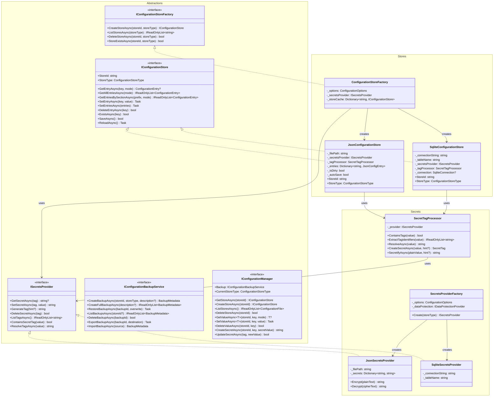

### High-Level System Architecture

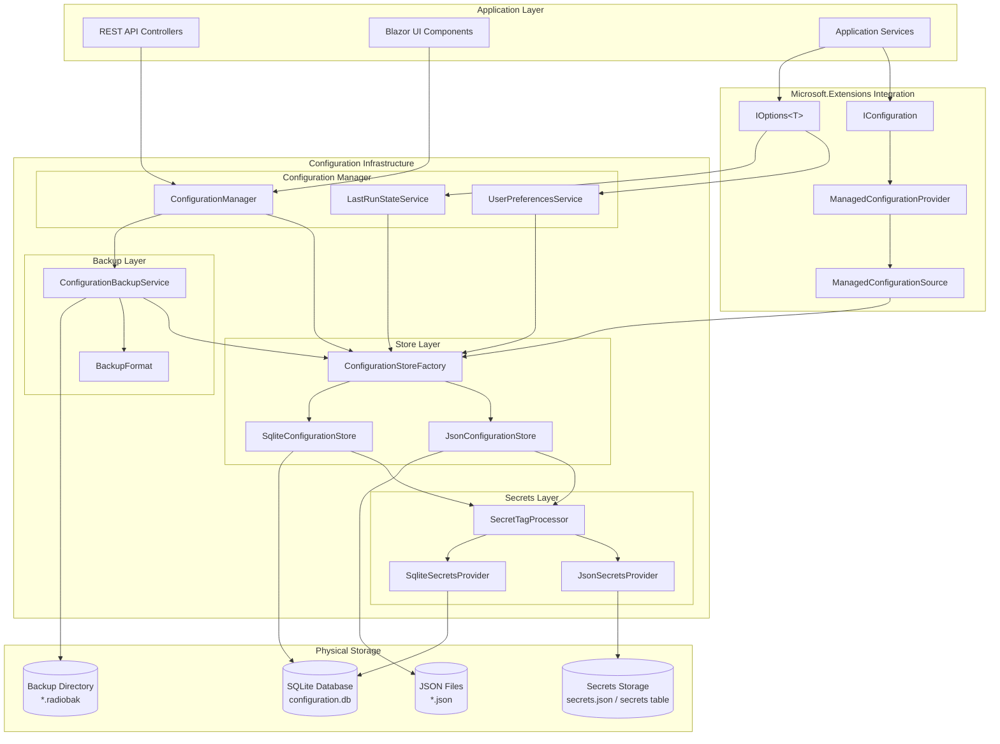

### Models and Enumerations

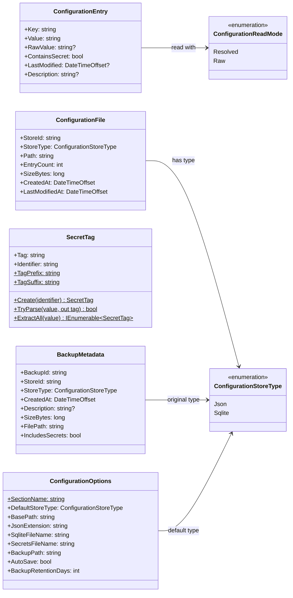

---

## Data Flow Diagrams

### Secret Resolution Flow

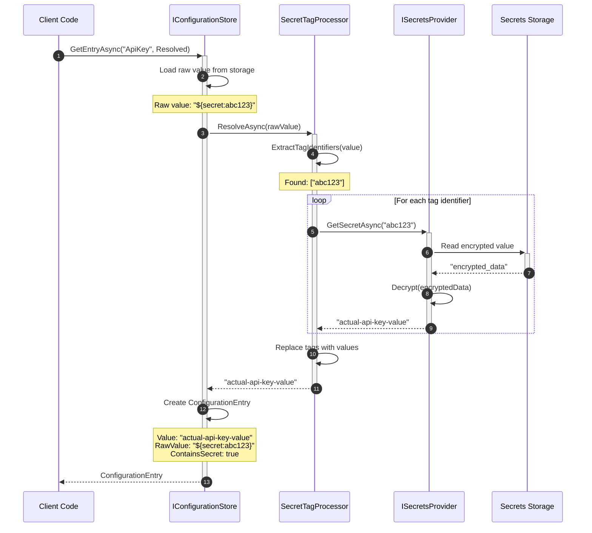

### Raw Mode Reading (UI Management)

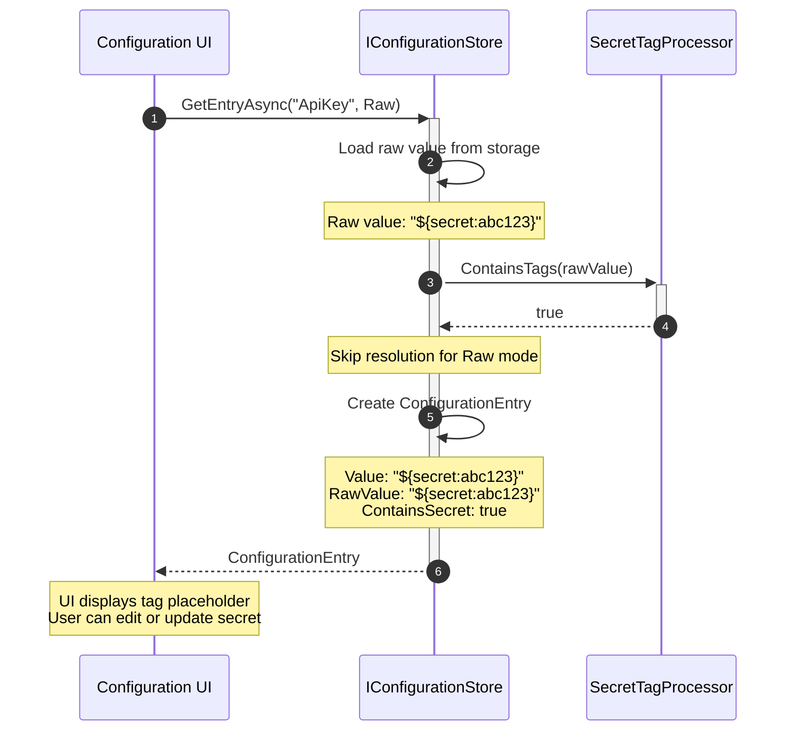

### Creating a New Secret

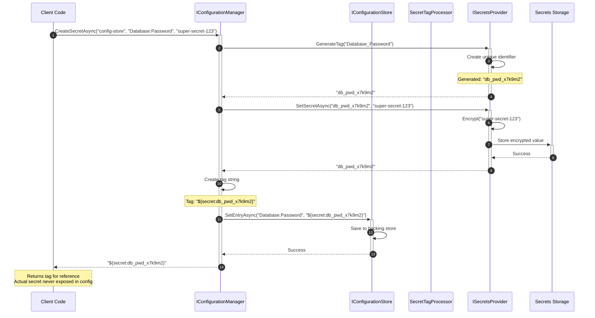

### Configuration Loading at Startup

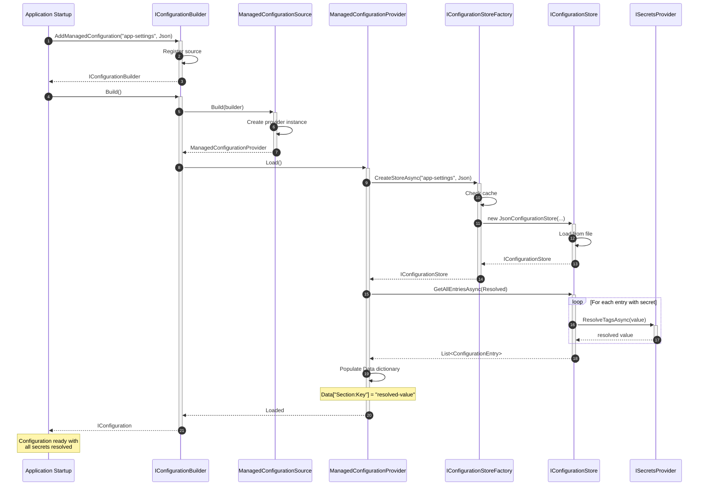

### Backup and Restore Flow

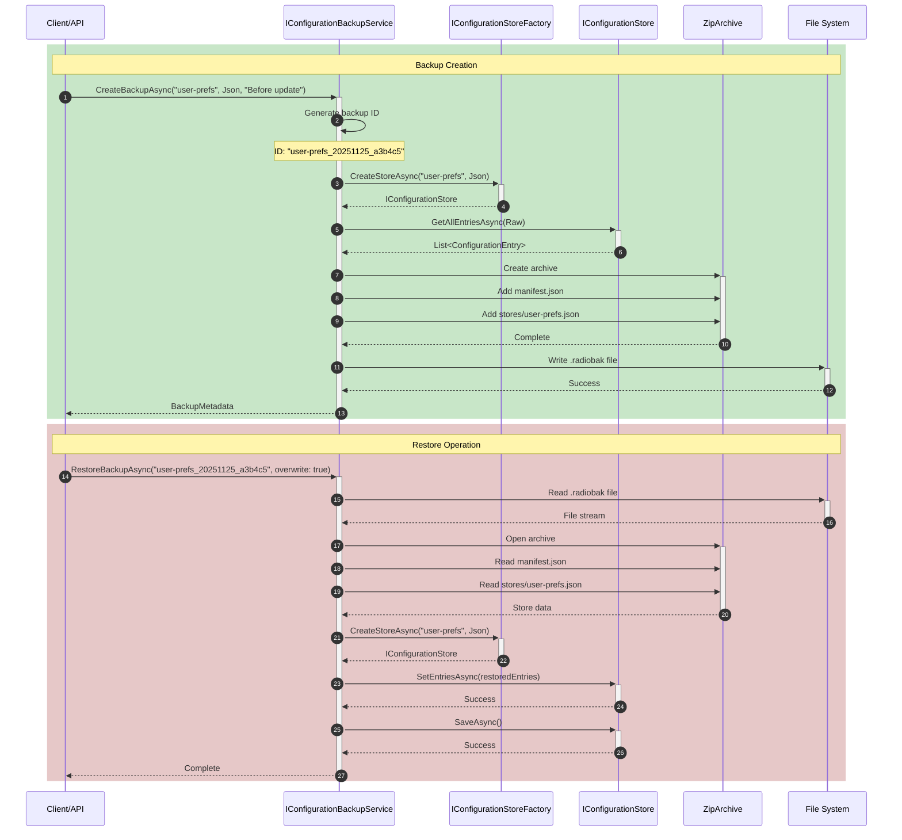

---

## State Transition Diagrams

### Configuration Store Lifecycle

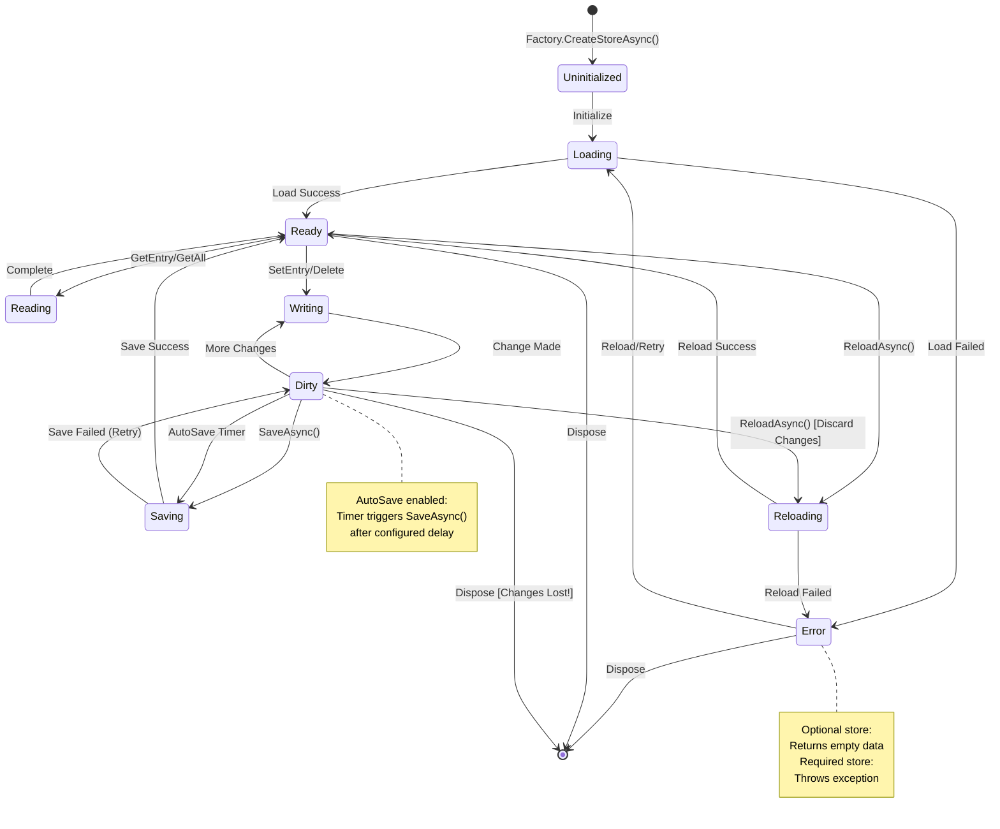

### Secret Tag Processing States

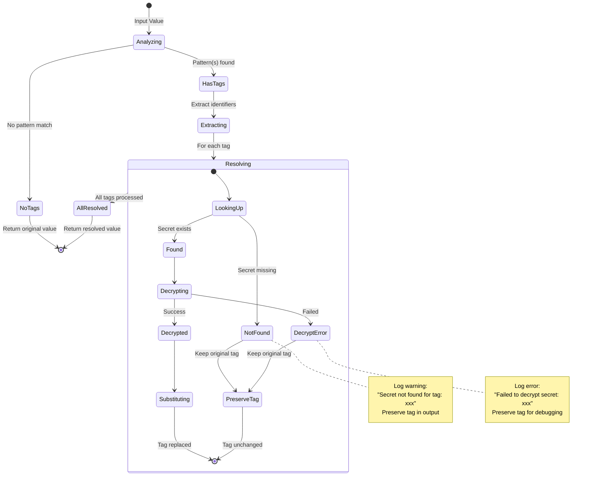

### Backup Lifecycle

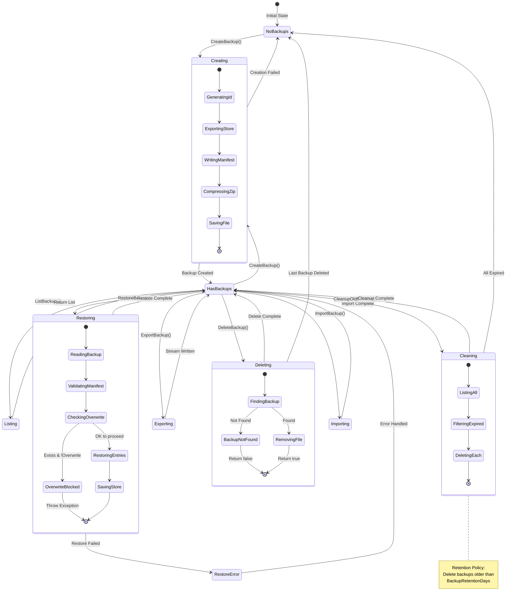

### User Preferences Service State

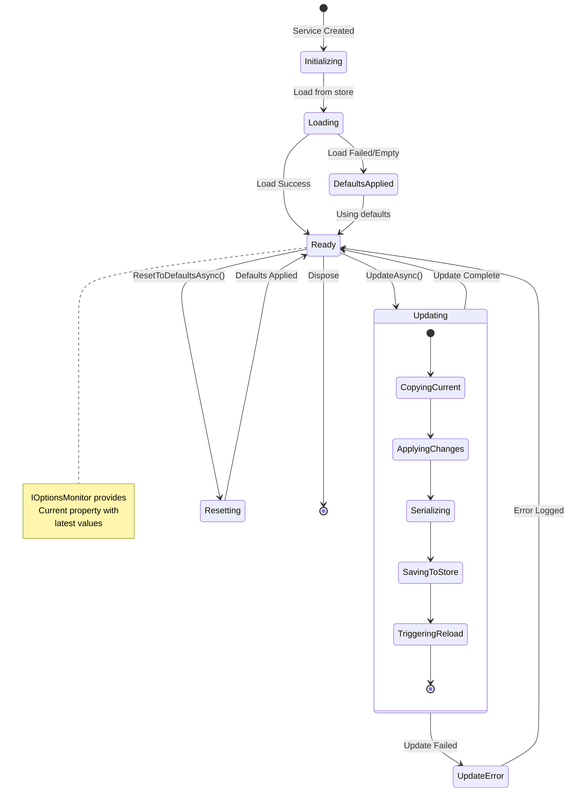

### Last Run State Service with Auto-Save

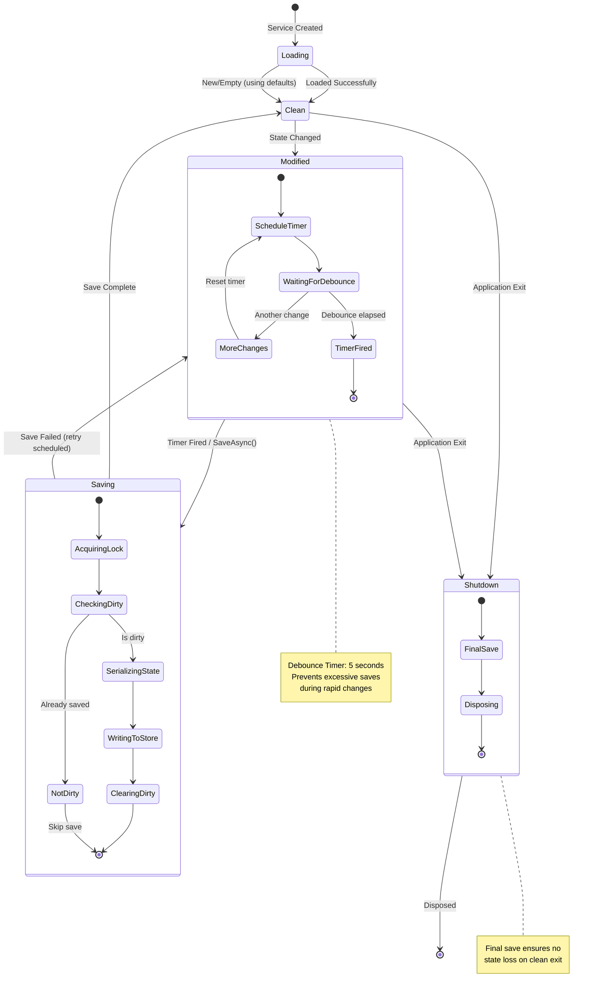

---

## Folder Structure

```
Radio.Infrastructure/
└── Configuration/
    ├── Abstractions/
    │   ├── IConfigurationStore.cs           # Core store abstraction
    │   ├── IConfigurationStoreFactory.cs    # Factory for creating stores
    │   ├── ISecretsProvider.cs              # Secrets resolution abstraction
    │   ├── IConfigurationBackupService.cs   # Backup/restore abstraction
    │   └── IConfigurationManager.cs         # High-level management interface
    │
    ├── Models/
    │   ├── ConfigurationEntry.cs            # Single key/value with metadata
    │   ├── ConfigurationFile.cs             # Represents a config file/table
    │   ├── ConfigurationReadMode.cs         # Enum: Raw, Resolved
    │   ├── ConfigurationStoreType.cs        # Enum: Json, Sqlite
    │   ├── SecretTag.cs                     # Secret reference tag model
    │   ├── BackupMetadata.cs                # Backup file metadata
    │   └── ConfigurationOptions.cs          # Options pattern configuration
    │
    ├── Stores/
    │   ├── JsonConfigurationStore.cs        # JSON file-based implementation
    │   ├── SqliteConfigurationStore.cs      # SQLite-based implementation
    │   └── ConfigurationStoreFactory.cs     # Factory implementation
    │
    ├── Secrets/
    │   ├── JsonSecretsProvider.cs           # JSON-based secrets storage
    │   ├── SqliteSecretsProvider.cs         # SQLite-based secrets storage
    │   ├── SecretTagProcessor.cs            # Tag detection and substitution
    │   └── SecretsProviderFactory.cs        # Factory for secrets providers
    │
    ├── Backup/
    │   ├── ConfigurationBackupService.cs    # Backup/restore implementation
    │   └── BackupFormat.cs                  # Backup serialization format
    │
    ├── Providers/
    │   ├── ManagedConfigurationProvider.cs  # IConfigurationProvider impl
    │   └── ManagedConfigurationSource.cs    # IConfigurationSource impl
    │
    ├── Services/
    │   ├── ConfigurationManager.cs          # High-level orchestration
    │   ├── UserPreferencesService.cs        # User preferences via IOptions
    │   └── LastRunStateService.cs           # Application state persistence
    │
    ├── Exceptions/
    │   ├── ConfigurationStoreException.cs
    │   ├── ConfigurationEntryNotFoundException.cs
    │   └── ConfigurationStoreCorruptedException.cs
    │
    └── Extensions/
        └── ConfigurationServiceExtensions.cs # DI registration helpers
```

---

## Phase 1: Core Abstractions and Models

### Objective
Establish the foundational interfaces and models that define the configuration system's contract.

### Deliverables
- All interfaces in `Abstractions/`
- All models in `Models/`
- Unit tests for model validation

### GitHub Copilot Prompt

```
## Phase 1: Core Abstractions and Models for Configuration Infrastructure

### Context
You are building a configuration infrastructure component for Radio.Infrastructure in a .NET 8 C# project. This component must support both SQLite and JSON file backing stores, with secrets management using tag-based substitution.

Reference the architecture diagrams in CONFIGURATION.md for the complete class structure and relationships.

### Task
Create the core abstractions and models for the configuration system.

### Requirements

#### 1. Create `Abstractions/IConfigurationStore.cs`
```csharp
namespace Radio.Infrastructure.Configuration.Abstractions;

/// <summary>
/// Represents a backing store for configuration data (JSON file or SQLite table).
/// Provides CRUD operations for configuration entries.
/// </summary>
public interface IConfigurationStore
{
    /// <summary>Gets the unique identifier for this store (filename or table name).</summary>
    string StoreId { get; }
    
    /// <summary>Gets the store type (Json or Sqlite).</summary>
    ConfigurationStoreType StoreType { get; }
    
    // Entry CRUD
    Task<ConfigurationEntry?> GetEntryAsync(string key, ConfigurationReadMode mode = ConfigurationReadMode.Resolved, CancellationToken ct = default);
    Task<IReadOnlyList<ConfigurationEntry>> GetAllEntriesAsync(ConfigurationReadMode mode = ConfigurationReadMode.Resolved, CancellationToken ct = default);
    Task<IReadOnlyList<ConfigurationEntry>> GetEntriesBySectionAsync(string sectionPrefix, ConfigurationReadMode mode = ConfigurationReadMode.Resolved, CancellationToken ct = default);
    Task SetEntryAsync(string key, string value, CancellationToken ct = default);
    Task SetEntriesAsync(IEnumerable<ConfigurationEntry> entries, CancellationToken ct = default);
    Task<bool> DeleteEntryAsync(string key, CancellationToken ct = default);
    Task<bool> ExistsAsync(string key, CancellationToken ct = default);
    
    // Store-level operations
    Task<bool> SaveAsync(CancellationToken ct = default);
    Task ReloadAsync(CancellationToken ct = default);
}
```

#### 2. Create `Abstractions/IConfigurationStoreFactory.cs`
```csharp
namespace Radio.Infrastructure.Configuration.Abstractions;

public interface IConfigurationStoreFactory
{
    /// <summary>Creates or opens an existing configuration store.</summary>
    Task<IConfigurationStore> CreateStoreAsync(string storeId, ConfigurationStoreType storeType, CancellationToken ct = default);
    
    /// <summary>Lists all available stores of the specified type.</summary>
    Task<IReadOnlyList<string>> ListStoresAsync(ConfigurationStoreType storeType, CancellationToken ct = default);
    
    /// <summary>Deletes a store (file or table).</summary>
    Task<bool> DeleteStoreAsync(string storeId, ConfigurationStoreType storeType, CancellationToken ct = default);
    
    /// <summary>Checks if a store exists.</summary>
    Task<bool> StoreExistsAsync(string storeId, ConfigurationStoreType storeType, CancellationToken ct = default);
}
```

#### 3. Create `Abstractions/ISecretsProvider.cs`
```csharp
namespace Radio.Infrastructure.Configuration.Abstractions;

public interface ISecretsProvider
{
    /// <summary>Retrieves the actual secret value for a given tag.</summary>
    Task<string?> GetSecretAsync(string tag, CancellationToken ct = default);
    
    /// <summary>Stores a secret and returns its tag identifier.</summary>
    Task<string> SetSecretAsync(string tag, string value, CancellationToken ct = default);
    
    /// <summary>Generates a new unique tag for a secret.</summary>
    string GenerateTag(string? hint = null);
    
    /// <summary>Deletes a secret by its tag.</summary>
    Task<bool> DeleteSecretAsync(string tag, CancellationToken ct = default);
    
    /// <summary>Lists all secret tags (not values).</summary>
    Task<IReadOnlyList<string>> ListTagsAsync(CancellationToken ct = default);
    
    /// <summary>Checks if a value contains a secret tag pattern.</summary>
    bool ContainsSecretTag(string value);
    
    /// <summary>Resolves all secret tags in a value, replacing with actual secrets.</summary>
    Task<string> ResolveTagsAsync(string value, CancellationToken ct = default);
}
```

#### 4. Create `Abstractions/IConfigurationBackupService.cs`
```csharp
namespace Radio.Infrastructure.Configuration.Abstractions;

public interface IConfigurationBackupService
{
    /// <summary>Creates a backup of the specified store.</summary>
    Task<BackupMetadata> CreateBackupAsync(string storeId, ConfigurationStoreType storeType, string? description = null, CancellationToken ct = default);
    
    /// <summary>Creates a backup of all stores.</summary>
    Task<IReadOnlyList<BackupMetadata>> CreateFullBackupAsync(string? description = null, CancellationToken ct = default);
    
    /// <summary>Restores a store from a backup.</summary>
    Task RestoreBackupAsync(string backupId, bool overwrite = false, CancellationToken ct = default);
    
    /// <summary>Lists all available backups.</summary>
    Task<IReadOnlyList<BackupMetadata>> ListBackupsAsync(string? storeId = null, CancellationToken ct = default);
    
    /// <summary>Deletes a backup.</summary>
    Task<bool> DeleteBackupAsync(string backupId, CancellationToken ct = default);
    
    /// <summary>Exports a backup to a stream (for download).</summary>
    Task ExportBackupAsync(string backupId, Stream destination, CancellationToken ct = default);
    
    /// <summary>Imports a backup from a stream (for upload).</summary>
    Task<BackupMetadata> ImportBackupAsync(Stream source, CancellationToken ct = default);
}
```

#### 5. Create `Abstractions/IConfigurationManager.cs`
```csharp
namespace Radio.Infrastructure.Configuration.Abstractions;

/// <summary>
/// High-level configuration management interface that orchestrates
/// stores, secrets, and backup operations.
/// </summary>
public interface IConfigurationManager
{
    // Store management
    Task<IConfigurationStore> GetStoreAsync(string storeId, CancellationToken ct = default);
    Task<IConfigurationStore> CreateStoreAsync(string storeId, CancellationToken ct = default);
    Task<IReadOnlyList<ConfigurationFile>> ListStoresAsync(CancellationToken ct = default);
    Task<bool> DeleteStoreAsync(string storeId, CancellationToken ct = default);
    
    // Configuration entry operations (delegates to appropriate store)
    Task<T?> GetValueAsync<T>(string storeId, string key, ConfigurationReadMode mode = ConfigurationReadMode.Resolved, CancellationToken ct = default);
    Task SetValueAsync<T>(string storeId, string key, T value, CancellationToken ct = default);
    Task<bool> DeleteValueAsync(string storeId, string key, CancellationToken ct = default);
    
    // Secret management
    Task<string> CreateSecretAsync(string storeId, string key, string secretValue, CancellationToken ct = default);
    Task<bool> UpdateSecretAsync(string tag, string newValue, CancellationToken ct = default);
    
    // Backup operations
    IConfigurationBackupService Backup { get; }
    
    // Current store type
    ConfigurationStoreType CurrentStoreType { get; }
}
```

#### 6. Create Models

**`Models/ConfigurationEntry.cs`**
```csharp
namespace Radio.Infrastructure.Configuration.Models;

/// <summary>
/// Represents a single configuration key-value pair with metadata.
/// </summary>
public sealed record ConfigurationEntry
{
    /// <summary>The configuration key (supports section notation with ':').</summary>
    public required string Key { get; init; }
    
    /// <summary>The configuration value (resolved if secrets were substituted).</summary>
    public required string Value { get; init; }
    
    /// <summary>Original value with secret tags intact (null if same as Value).</summary>
    public string? RawValue { get; init; }
    
    /// <summary>Indicates whether this entry contains or contained a secret tag.</summary>
    public bool ContainsSecret { get; init; }
    
    /// <summary>When this entry was last modified.</summary>
    public DateTimeOffset? LastModified { get; init; }
    
    /// <summary>Optional description for documentation purposes.</summary>
    public string? Description { get; init; }
}
```

**`Models/ConfigurationFile.cs`**
```csharp
namespace Radio.Infrastructure.Configuration.Models;

/// <summary>
/// Represents metadata about a configuration store (file or table).
/// </summary>
public sealed record ConfigurationFile
{
    /// <summary>Unique identifier for this store.</summary>
    public required string StoreId { get; init; }
    
    /// <summary>The backing store type.</summary>
    public required ConfigurationStoreType StoreType { get; init; }
    
    /// <summary>Physical path (file path or "table:name").</summary>
    public required string Path { get; init; }
    
    /// <summary>Number of configuration entries in this store.</summary>
    public int EntryCount { get; init; }
    
    /// <summary>Size of the store in bytes.</summary>
    public long SizeBytes { get; init; }
    
    /// <summary>When this store was created.</summary>
    public DateTimeOffset CreatedAt { get; init; }
    
    /// <summary>When this store was last modified.</summary>
    public DateTimeOffset LastModifiedAt { get; init; }
}
```

**`Models/ConfigurationReadMode.cs`**
```csharp
namespace Radio.Infrastructure.Configuration.Models;

/// <summary>
/// Specifies how configuration values should be read.
/// </summary>
public enum ConfigurationReadMode
{
    /// <summary>
    /// Returns values with secret tags resolved to actual secret values.
    /// This is the default mode for normal application use.
    /// </summary>
    Resolved = 0,
    
    /// <summary>
    /// Returns raw values with secret tags intact (e.g., "${secret:abc123}").
    /// Use this mode for UI configuration management.
    /// </summary>
    Raw = 1
}
```

**`Models/ConfigurationStoreType.cs`**
```csharp
namespace Radio.Infrastructure.Configuration.Models;

/// <summary>
/// Specifies the backing store type for configuration data.
/// </summary>
public enum ConfigurationStoreType
{
    /// <summary>JSON file-based storage.</summary>
    Json = 0,
    
    /// <summary>SQLite database storage.</summary>
    Sqlite = 1
}
```

**`Models/SecretTag.cs`**
```csharp
namespace Radio.Infrastructure.Configuration.Models;

using System.Text.RegularExpressions;

/// <summary>
/// Represents a secret tag reference in configuration values.
/// Format: ${secret:identifier}
/// </summary>
public sealed record SecretTag
{
    /// <summary>The prefix for all secret tags.</summary>
    public const string TagPrefix = "${secret:";
    
    /// <summary>The suffix for all secret tags.</summary>
    public const string TagSuffix = "}";
    
    private static readonly Regex TagPattern = new(
        @"\$\{secret:([a-zA-Z0-9_-]+)\}",
        RegexOptions.Compiled);
    
    /// <summary>The full tag string (e.g., "${secret:abc123}").</summary>
    public required string Tag { get; init; }
    
    /// <summary>The identifier portion only (e.g., "abc123").</summary>
    public required string Identifier { get; init; }
    
    /// <summary>Creates a SecretTag from an identifier.</summary>
    public static SecretTag Create(string identifier) => new()
    {
        Tag = $"{TagPrefix}{identifier}{TagSuffix}",
        Identifier = identifier
    };
    
    /// <summary>Attempts to parse a secret tag from a string.</summary>
    public static bool TryParse(string value, out SecretTag? tag)
    {
        tag = null;
        var match = TagPattern.Match(value);
        if (!match.Success) return false;
        
        tag = new SecretTag
        {
            Tag = match.Value,
            Identifier = match.Groups[1].Value
        };
        return true;
    }
    
    /// <summary>Extracts all secret tags from a string.</summary>
    public static IEnumerable<SecretTag> ExtractAll(string value)
    {
        if (string.IsNullOrEmpty(value)) yield break;
        
        foreach (Match match in TagPattern.Matches(value))
        {
            yield return new SecretTag
            {
                Tag = match.Value,
                Identifier = match.Groups[1].Value
            };
        }
    }
    
    /// <summary>Checks if a string contains any secret tags.</summary>
    public static bool ContainsTag(string? value) =>
        !string.IsNullOrEmpty(value) && TagPattern.IsMatch(value);
}
```

**`Models/BackupMetadata.cs`**
```csharp
namespace Radio.Infrastructure.Configuration.Models;

/// <summary>
/// Metadata about a configuration backup.
/// </summary>
public sealed record BackupMetadata
{
    /// <summary>Unique identifier for this backup.</summary>
    public required string BackupId { get; init; }
    
    /// <summary>The store that was backed up.</summary>
    public required string StoreId { get; init; }
    
    /// <summary>Original store type.</summary>
    public required ConfigurationStoreType StoreType { get; init; }
    
    /// <summary>When the backup was created.</summary>
    public required DateTimeOffset CreatedAt { get; init; }
    
    /// <summary>Optional description of the backup.</summary>
    public string? Description { get; init; }
    
    /// <summary>Size of the backup file in bytes.</summary>
    public required long SizeBytes { get; init; }
    
    /// <summary>Path to the backup file.</summary>
    public required string FilePath { get; init; }
    
    /// <summary>Whether this backup includes secrets.</summary>
    public bool IncludesSecrets { get; init; }
}
```

**`Models/ConfigurationOptions.cs`**
```csharp
namespace Radio.Infrastructure.Configuration.Models;

/// <summary>
/// Configuration options for the managed configuration system.
/// </summary>
public sealed class ConfigurationOptions
{
    /// <summary>Configuration section name for binding.</summary>
    public const string SectionName = "ManagedConfiguration";
    
    /// <summary>Default backing store type.</summary>
    public ConfigurationStoreType DefaultStoreType { get; set; } = ConfigurationStoreType.Json;
    
    /// <summary>Base path for configuration files.</summary>
    public string BasePath { get; set; } = "./config";
    
    /// <summary>File extension for JSON configuration files.</summary>
    public string JsonExtension { get; set; } = ".json";
    
    /// <summary>SQLite database filename.</summary>
    public string SqliteFileName { get; set; } = "configuration.db";
    
    /// <summary>Secrets storage filename (extension added based on store type).</summary>
    public string SecretsFileName { get; set; } = "secrets";
    
    /// <summary>Path for backup files.</summary>
    public string BackupPath { get; set; } = "./config/backups";
    
    /// <summary>Whether to auto-save changes.</summary>
    public bool AutoSave { get; set; } = true;
    
    /// <summary>Number of days to retain backups.</summary>
    public int BackupRetentionDays { get; set; } = 30;
    
    /// <summary>Debounce delay for auto-save in milliseconds.</summary>
    public int AutoSaveDebounceMs { get; set; } = 5000;
}
```

### Unit Tests Required
Create in `Radio.Tests/Configuration/Models/`:

```csharp
public class SecretTagTests
{
    [Theory]
    [InlineData("${secret:abc123}", true, "abc123")]
    [InlineData("${secret:my-api-key}", true, "my-api-key")]
    [InlineData("${secret:db_password_1}", true, "db_password_1")]
    [InlineData("normal value", false, null)]
    [InlineData("${secret:}", false, null)]
    [InlineData("${secret:has spaces}", false, null)]
    [InlineData("${secret:special!chars}", false, null)]
    [InlineData("", false, null)]
    [InlineData(null, false, null)]
    public void TryParse_VariousInputs_ReturnsExpected(string? input, bool shouldParse, string? expectedId);
    
    [Fact]
    public void ExtractAll_MultipleTagsInString_ReturnsAllTags();
    
    [Fact]
    public void ExtractAll_NoTags_ReturnsEmpty();
    
    [Fact]
    public void Create_ValidIdentifier_CreatesProperTag();
    
    [Fact]
    public void ContainsTag_MixedContent_DetectsTag();
}

public class ConfigurationEntryTests
{
    [Fact]
    public void Record_Equality_WorksCorrectly();
    
    [Fact]
    public void Record_WithExpression_CreatesModifiedCopy();
}
```

### Acceptance Criteria
- [ ] All interfaces compile without errors
- [ ] All models have proper XML documentation
- [ ] SecretTag has working TryParse and ExtractAll methods
- [ ] SecretTag regex handles edge cases correctly
- [ ] Unit tests pass for all model validation
- [ ] No circular dependencies between files
- [ ] Models use C# record types for immutability where appropriate
```

---

## Phase 2: Secrets Management

### Objective
Implement the secrets provider system that enables tag-based secret substitution.

### Deliverables
- `SecretTagProcessor` for tag detection and substitution
- `JsonSecretsProvider` implementation
- `SqliteSecretsProvider` implementation
- `SecretsProviderFactory`
- Unit tests for secrets operations

### GitHub Copilot Prompt

```
## Phase 2: Secrets Management Implementation

### Context
Building on Phase 1's abstractions, implement the secrets management system. Secrets use a tag format `${secret:identifier}` that appears in configuration files, with actual values stored separately and encrypted.

Reference the "Secret Resolution Flow" and "Creating a New Secret" sequence diagrams in CONFIGURATION.md.

### Task
Implement the complete secrets management subsystem.

### Requirements

#### 1. Create `Secrets/SecretTagProcessor.cs`
This class handles detection and substitution of secret tags in configuration values.

```csharp
namespace Radio.Infrastructure.Configuration.Secrets;

using System.Text.RegularExpressions;
using Microsoft.Extensions.Logging;

/// <summary>
/// Processes secret tags in configuration values, handling detection,
/// extraction, and resolution of secrets.
/// </summary>
public sealed class SecretTagProcessor
{
    private static readonly Regex TagPattern = new(
        @"\$\{secret:([a-zA-Z0-9_-]+)\}",
        RegexOptions.Compiled);
    
    private readonly ISecretsProvider _provider;
    private readonly ILogger<SecretTagProcessor> _logger;
    
    public SecretTagProcessor(ISecretsProvider provider, ILogger<SecretTagProcessor> logger)
    {
        _provider = provider ?? throw new ArgumentNullException(nameof(provider));
        _logger = logger ?? throw new ArgumentNullException(nameof(logger));
    }
    
    /// <summary>Checks if value contains any secret tags.</summary>
    public bool ContainsTags(string? value) => SecretTag.ContainsTag(value);
    
    /// <summary>Extracts all tag identifiers from a value.</summary>
    public IReadOnlyList<string> ExtractTagIdentifiers(string value)
    {
        return SecretTag.ExtractAll(value)
            .Select(t => t.Identifier)
            .ToList();
    }
    
    /// <summary>Resolves all tags in value, replacing with actual secrets.</summary>
    public async Task<string> ResolveAsync(string value, CancellationToken ct = default)
    {
        if (string.IsNullOrEmpty(value) || !ContainsTags(value))
            return value;
        
        var result = value;
        var tags = SecretTag.ExtractAll(value).ToList();
        
        foreach (var tag in tags)
        {
            var secret = await _provider.GetSecretAsync(tag.Identifier, ct);
            if (secret != null)
            {
                result = result.Replace(tag.Tag, secret);
            }
            else
            {
                _logger.LogWarning("Secret not found for tag: {TagIdentifier}", tag.Identifier);
                // Preserve original tag if secret not found
            }
        }
        
        return result;
    }
    
    /// <summary>Creates a new secret and returns the tag to use in config.</summary>
    public async Task<SecretTag> CreateSecretAsync(string value, string? hint = null, CancellationToken ct = default)
    {
        var identifier = _provider.GenerateTag(hint);
        await _provider.SetSecretAsync(identifier, value, ct);
        return SecretTag.Create(identifier);
    }
    
    /// <summary>Wraps a value in a secret tag (for converting plain text to secret).</summary>
    public async Task<string> SecretifyAsync(string plainValue, string? hint = null, CancellationToken ct = default)
    {
        var tag = await CreateSecretAsync(plainValue, hint, ct);
        return tag.Tag;
    }
}
```

#### 2. Create `Secrets/JsonSecretsProvider.cs`
Stores secrets in a JSON file, encrypted at rest using Data Protection API.

```csharp
namespace Radio.Infrastructure.Configuration.Secrets;

using System.Text.Json;
using Microsoft.AspNetCore.DataProtection;
using Microsoft.Extensions.Logging;

/// <summary>
/// Stores secrets in an encrypted JSON file.
/// </summary>
public sealed class JsonSecretsProvider : ISecretsProvider, IDisposable
{
    private readonly string _filePath;
    private readonly IDataProtector _protector;
    private readonly ILogger<JsonSecretsProvider> _logger;
    private readonly SemaphoreSlim _lock = new(1, 1);
    private readonly JsonSerializerOptions _jsonOptions;
    
    private Dictionary<string, string> _secrets = new();
    private bool _isLoaded;
    
    public JsonSecretsProvider(
        string filePath,
        IDataProtectionProvider dataProtection,
        ILogger<JsonSecretsProvider> logger)
    {
        _filePath = filePath ?? throw new ArgumentNullException(nameof(filePath));
        _protector = dataProtection.CreateProtector("Radio.Configuration.Secrets");
        _logger = logger ?? throw new ArgumentNullException(nameof(logger));
        _jsonOptions = new JsonSerializerOptions
        {
            WriteIndented = true,
            PropertyNamingPolicy = JsonNamingPolicy.CamelCase
        };
    }
    
    public async Task<string?> GetSecretAsync(string tag, CancellationToken ct = default)
    {
        await EnsureLoadedAsync(ct);
        await _lock.WaitAsync(ct);
        try
        {
            if (_secrets.TryGetValue(tag, out var encrypted))
            {
                return Decrypt(encrypted);
            }
            return null;
        }
        finally
        {
            _lock.Release();
        }
    }
    
    public async Task<string> SetSecretAsync(string tag, string value, CancellationToken ct = default)
    {
        await EnsureLoadedAsync(ct);
        await _lock.WaitAsync(ct);
        try
        {
            var encrypted = Encrypt(value);
            _secrets[tag] = encrypted;
            await SaveAsync(ct);
            _logger.LogInformation("Secret stored with tag: {Tag}", tag);
            return tag;
        }
        finally
        {
            _lock.Release();
        }
    }
    
    public string GenerateTag(string? hint = null)
    {
        var id = Guid.NewGuid().ToString("N")[..12];
        if (!string.IsNullOrWhiteSpace(hint))
        {
            // Sanitize hint for use in identifier
            var sanitized = new string(hint
                .Replace(":", "_")
                .Replace(" ", "_")
                .Where(c => char.IsLetterOrDigit(c) || c == '_' || c == '-')
                .Take(20)
                .ToArray());
            if (!string.IsNullOrEmpty(sanitized))
            {
                return $"{sanitized}_{id}";
            }
        }
        return id;
    }
    
    public async Task<bool> DeleteSecretAsync(string tag, CancellationToken ct = default)
    {
        await EnsureLoadedAsync(ct);
        await _lock.WaitAsync(ct);
        try
        {
            if (_secrets.Remove(tag))
            {
                await SaveAsync(ct);
                _logger.LogInformation("Secret deleted: {Tag}", tag);
                return true;
            }
            return false;
        }
        finally
        {
            _lock.Release();
        }
    }
    
    public async Task<IReadOnlyList<string>> ListTagsAsync(CancellationToken ct = default)
    {
        await EnsureLoadedAsync(ct);
        await _lock.WaitAsync(ct);
        try
        {
            return _secrets.Keys.ToList();
        }
        finally
        {
            _lock.Release();
        }
    }
    
    public bool ContainsSecretTag(string value) => SecretTag.ContainsTag(value);
    
    public async Task<string> ResolveTagsAsync(string value, CancellationToken ct = default)
    {
        if (string.IsNullOrEmpty(value) || !ContainsSecretTag(value))
            return value;
        
        var result = value;
        foreach (var tag in SecretTag.ExtractAll(value))
        {
            var secret = await GetSecretAsync(tag.Identifier, ct);
            if (secret != null)
            {
                result = result.Replace(tag.Tag, secret);
            }
        }
        return result;
    }
    
    private async Task EnsureLoadedAsync(CancellationToken ct)
    {
        if (_isLoaded) return;
        
        await _lock.WaitAsync(ct);
        try
        {
            if (_isLoaded) return;
            await LoadAsync(ct);
            _isLoaded = true;
        }
        finally
        {
            _lock.Release();
        }
    }
    
    private async Task LoadAsync(CancellationToken ct)
    {
        if (!File.Exists(_filePath))
        {
            _secrets = new Dictionary<string, string>();
            return;
        }
        
        try
        {
            var json = await File.ReadAllTextAsync(_filePath, ct);
            var data = JsonSerializer.Deserialize<SecretsFile>(json, _jsonOptions);
            _secrets = data?.Secrets ?? new Dictionary<string, string>();
        }
        catch (Exception ex)
        {
            _logger.LogError(ex, "Failed to load secrets file: {Path}", _filePath);
            _secrets = new Dictionary<string, string>();
        }
    }
    
    private async Task SaveAsync(CancellationToken ct)
    {
        var directory = Path.GetDirectoryName(_filePath);
        if (!string.IsNullOrEmpty(directory) && !Directory.Exists(directory))
        {
            Directory.CreateDirectory(directory);
        }
        
        var data = new SecretsFile
        {
            Version = 1,
            LastModified = DateTimeOffset.UtcNow,
            Secrets = _secrets
        };
        
        // Atomic write using temp file
        var tempPath = _filePath + ".tmp";
        var json = JsonSerializer.Serialize(data, _jsonOptions);
        await File.WriteAllTextAsync(tempPath, json, ct);
        File.Move(tempPath, _filePath, overwrite: true);
    }
    
    private string Encrypt(string plainText)
    {
        return _protector.Protect(plainText);
    }
    
    private string Decrypt(string cipherText)
    {
        try
        {
            return _protector.Unprotect(cipherText);
        }
        catch (Exception ex)
        {
            _logger.LogError(ex, "Failed to decrypt secret");
            throw new InvalidOperationException("Failed to decrypt secret", ex);
        }
    }
    
    public void Dispose()
    {
        _lock.Dispose();
    }
    
    private sealed record SecretsFile
    {
        public int Version { get; init; }
        public DateTimeOffset LastModified { get; init; }
        public Dictionary<string, string> Secrets { get; init; } = new();
    }
}
```

#### 3. Create `Secrets/SqliteSecretsProvider.cs`
Stores secrets in a SQLite table with encryption.

```csharp
namespace Radio.Infrastructure.Configuration.Secrets;

using Microsoft.AspNetCore.DataProtection;
using Microsoft.Data.Sqlite;
using Microsoft.Extensions.Logging;

/// <summary>
/// Stores secrets in a SQLite database table with encryption.
/// </summary>
public sealed class SqliteSecretsProvider : ISecretsProvider, IAsyncDisposable
{
    private const string TableName = "Secrets";
    
    private readonly string _connectionString;
    private readonly IDataProtector _protector;
    private readonly ILogger<SqliteSecretsProvider> _logger;
    private readonly SemaphoreSlim _lock = new(1, 1);
    
    private SqliteConnection? _connection;
    private bool _tableCreated;
    
    public SqliteSecretsProvider(
        string connectionString,
        IDataProtectionProvider dataProtection,
        ILogger<SqliteSecretsProvider> logger)
    {
        _connectionString = connectionString ?? throw new ArgumentNullException(nameof(connectionString));
        _protector = dataProtection.CreateProtector("Radio.Configuration.Secrets");
        _logger = logger ?? throw new ArgumentNullException(nameof(logger));
    }
    
    public async Task<string?> GetSecretAsync(string tag, CancellationToken ct = default)
    {
        await EnsureInitializedAsync(ct);
        
        var sql = $"SELECT Value FROM {TableName} WHERE Tag = @Tag";
        await using var cmd = _connection!.CreateCommand();
        cmd.CommandText = sql;
        cmd.Parameters.AddWithValue("@Tag", tag);
        
        var result = await cmd.ExecuteScalarAsync(ct);
        if (result is string encrypted)
        {
            // Update last accessed time
            await UpdateLastAccessedAsync(tag, ct);
            return Decrypt(encrypted);
        }
        return null;
    }
    
    public async Task<string> SetSecretAsync(string tag, string value, CancellationToken ct = default)
    {
        await EnsureInitializedAsync(ct);
        
        var encrypted = Encrypt(value);
        var now = DateTimeOffset.UtcNow.ToString("O");
        
        var sql = $@"
            INSERT INTO {TableName} (Tag, Value, CreatedAt, LastAccessedAt)
            VALUES (@Tag, @Value, @CreatedAt, @LastAccessedAt)
            ON CONFLICT(Tag) DO UPDATE SET
                Value = @Value,
                LastAccessedAt = @LastAccessedAt";
        
        await using var cmd = _connection!.CreateCommand();
        cmd.CommandText = sql;
        cmd.Parameters.AddWithValue("@Tag", tag);
        cmd.Parameters.AddWithValue("@Value", encrypted);
        cmd.Parameters.AddWithValue("
