# Configuration Infrastructure Development Plan

## Overview

This document provides a comprehensive phased development plan for building a robust configuration infrastructure within `Radio.Infrastructure`. The system will provide unified configuration management with support for:

- **Microsoft.Extensions.Configuration** for basic configuration
- **Microsoft.Extensions.Options** for user preferences and "last run" state
- **Secrets management** with tag-based substitution (inspired by UserSecrets pattern)
- **Dual backing stores**: SQLite and native JSON files
- **Full CRUD operations** on configuration files/tables and individual key/values
- **Backup/Restore** capabilities
- **Raw vs. Resolved** reading modes for UI management scenarios

---

## Architecture Diagrams

### Component Architecture Overview

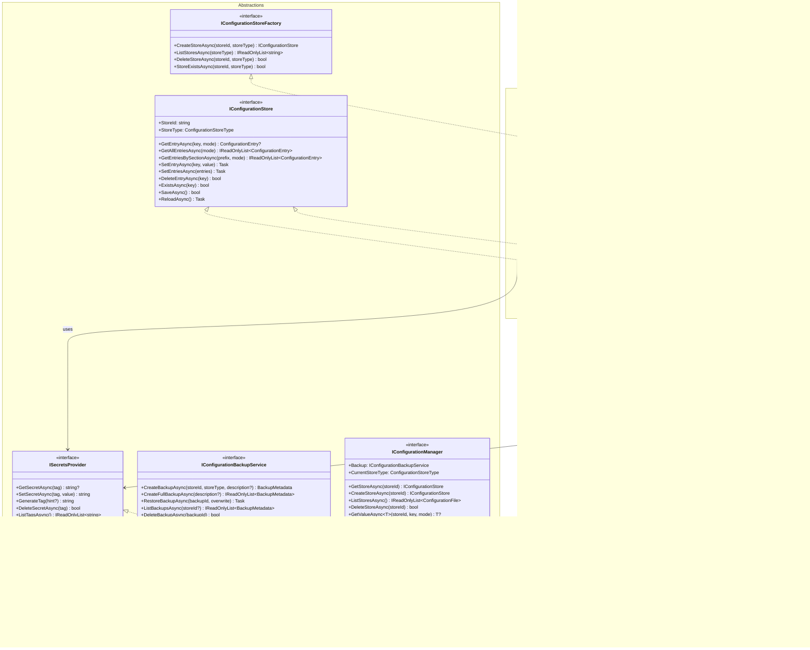
```mermaid
classDiagram
    direction TB
    
    %% Abstractions Layer
    namespace Abstractions {
        class IConfigurationStore {
            <<interface>>
            +StoreId: string
            +StoreType: ConfigurationStoreType
            +GetEntryAsync(key, mode) ConfigurationEntry?
            +GetAllEntriesAsync(mode) IReadOnlyList~ConfigurationEntry~
            +GetEntriesBySectionAsync(prefix, mode) IReadOnlyList~ConfigurationEntry~
            +SetEntryAsync(key, value) Task
            +SetEntriesAsync(entries) Task
            +DeleteEntryAsync(key) bool
            +ExistsAsync(key) bool
            +SaveAsync() bool
            +ReloadAsync() Task
        }
        
        class IConfigurationStoreFactory {
            <<interface>>
            +CreateStoreAsync(storeId, storeType) IConfigurationStore
            +ListStoresAsync(storeType) IReadOnlyList~string~
            +DeleteStoreAsync(storeId, storeType) bool
            +StoreExistsAsync(storeId, storeType) bool
        }
        
        class ISecretsProvider {
            <<interface>>
            +GetSecretAsync(tag) string?
            +SetSecretAsync(tag, value) string
            +GenerateTag(hint?) string
            +DeleteSecretAsync(tag) bool
            +ListTagsAsync() IReadOnlyList~string~
            +ContainsSecretTag(value) bool
            +ResolveTagsAsync(value) string
        }
        
        class IConfigurationBackupService {
            <<interface>>
            +CreateBackupAsync(storeId, storeType, description?) BackupMetadata
            +CreateFullBackupAsync(description?) IReadOnlyList~BackupMetadata~
            +RestoreBackupAsync(backupId, overwrite) Task
            +ListBackupsAsync(storeId?) IReadOnlyList~BackupMetadata~
            +DeleteBackupAsync(backupId) bool
            +ExportBackupAsync(backupId, destination) Task
            +ImportBackupAsync(source) BackupMetadata
        }
        
        class IConfigurationManager {
            <<interface>>
            +GetStoreAsync(storeId) IConfigurationStore
            +CreateStoreAsync(storeId) IConfigurationStore
            +ListStoresAsync() IReadOnlyList~ConfigurationFile~
            +DeleteStoreAsync(storeId) bool
            +GetValueAsync~T~(storeId, key, mode) T?
            +SetValueAsync~T~(storeId, key, value) Task
            +DeleteValueAsync(storeId, key) bool
            +CreateSecretAsync(storeId, key, secretValue) string
            +UpdateSecretAsync(tag, newValue) bool
            +Backup: IConfigurationBackupService
            +CurrentStoreType: ConfigurationStoreType
        }
    }
    
    %% Store Implementations
    namespace Stores {
        class JsonConfigurationStore {
            -_filePath: string
            -_secretsProvider: ISecretsProvider
            -_tagProcessor: SecretTagProcessor
            -_entries: Dictionary~string, JsonConfigEntry~
            -_isDirty: bool
            -_autoSave: bool
            +StoreId: string
            +StoreType: ConfigurationStoreType
        }
        
        class SqliteConfigurationStore {
            -_connectionString: string
            -_tableName: string
            -_secretsProvider: ISecretsProvider
            -_tagProcessor: SecretTagProcessor
            -_connection: SqliteConnection?
            +StoreId: string
            +StoreType: ConfigurationStoreType
        }
        
        class ConfigurationStoreFactory {
            -_options: ConfigurationOptions
            -_secretsProvider: ISecretsProvider
            -_storeCache: Dictionary~string, IConfigurationStore~
        }
    }
    
    %% Secrets Implementation
    namespace Secrets {
        class SecretTagProcessor {
            -_provider: ISecretsProvider
            +ContainsTags(value) bool
            +ExtractTagIdentifiers(value) IReadOnlyList~string~
            +ResolveAsync(value) string
            +CreateSecretAsync(value, hint?) SecretTag
            +SecretifyAsync(plainValue, hint?) string
        }
        
        class JsonSecretsProvider {
            -_filePath: string
            -_secrets: Dictionary~string, string~
            +Encrypt(plainText) string
            +Decrypt(cipherText) string
        }
        
        class SqliteSecretsProvider {
            -_connectionString: string
            -_tableName: string
        }
        
        class SecretsProviderFactory {
            -_options: ConfigurationOptions
            -_dataProtection: IDataProtectionProvider
            +Create(storeType) ISecretsProvider
        }
    }
    
    %% Relationships
    IConfigurationStore <|.. JsonConfigurationStore
    IConfigurationStore <|.. SqliteConfigurationStore
    IConfigurationStoreFactory <|.. ConfigurationStoreFactory
    ISecretsProvider <|.. JsonSecretsProvider
    ISecretsProvider <|.. SqliteSecretsProvider
    
    ConfigurationStoreFactory --> ISecretsProvider : uses
    JsonConfigurationStore --> SecretTagProcessor : uses
    SqliteConfigurationStore --> SecretTagProcessor : uses
    SecretTagProcessor --> ISecretsProvider : uses
    SecretsProviderFactory --> JsonSecretsProvider : creates
    SecretsProviderFactory --> SqliteSecretsProvider : creates
    ConfigurationStoreFactory --> JsonConfigurationStore : creates
    ConfigurationStoreFactory --> SqliteConfigurationStore : creates
```

### High-Level System Architecture

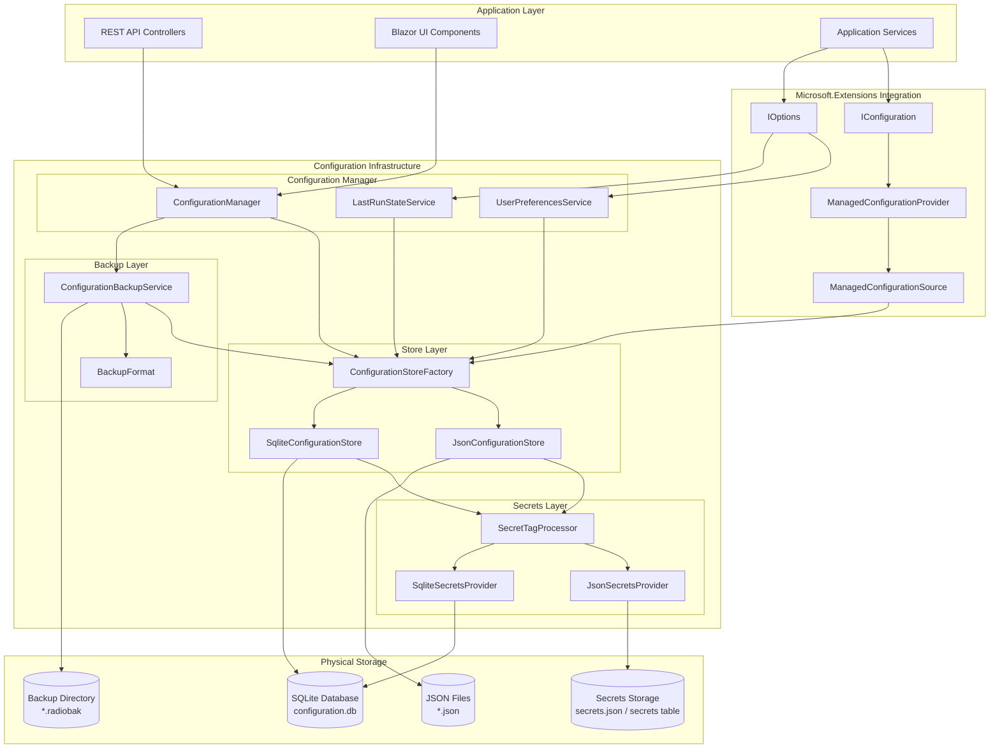
```mermaid
flowchart TB
    subgraph Application["Application Layer"]
        API["REST API Controllers"]
        Blazor["Blazor UI Components"]
        Services["Application Services"]
    end
    
    subgraph Extensions["Microsoft.Extensions Integration"]
        IConfig["IConfiguration"]
        IOptions["IOptions<T>"]
        MCP["ManagedConfigurationProvider"]
        MCS["ManagedConfigurationSource"]
    end
    
    subgraph ConfigInfra["Configuration Infrastructure"]
        direction TB
        
        subgraph Manager["Configuration Manager"]
            CM["ConfigurationManager"]
            UPS["UserPreferencesService"]
            LRS["LastRunStateService"]
        end
        
        subgraph StoreLayer["Store Layer"]
            Factory["ConfigurationStoreFactory"]
            JSON["JsonConfigurationStore"]
            SQLite["SqliteConfigurationStore"]
        end
        
        subgraph SecretsLayer["Secrets Layer"]
            STP["SecretTagProcessor"]
            JSP["JsonSecretsProvider"]
            SSP["SqliteSecretsProvider"]
        end
        
        subgraph BackupLayer["Backup Layer"]
            CBS["ConfigurationBackupService"]
            BF["BackupFormat"]
        end
    end
    
    subgraph Storage["Physical Storage"]
        JSONFiles[("JSON Files<br/>*.json")]
        SQLiteDB[("SQLite Database<br/>configuration.db")]
        SecretsFile[("Secrets Storage<br/>secrets.json / secrets table")]
        BackupDir[("Backup Directory<br/>*.radiobak")]
    end
    
    %% Application connections
    API --> CM
    Blazor --> CM
    Services --> IConfig
    Services --> IOptions
    
    %% Extensions connections
    IConfig --> MCP
    MCP --> MCS
    MCS --> Factory
    IOptions --> UPS
    IOptions --> LRS
    
    %% Manager connections
    CM --> Factory
    CM --> CBS
    UPS --> Factory
    LRS --> Factory
    
    %% Store connections
    Factory --> JSON
    Factory --> SQLite
    JSON --> STP
    SQLite --> STP
    
    %% Secrets connections
    STP --> JSP
    STP --> SSP
    
    %% Backup connections
    CBS --> Factory
    CBS --> BF
    
    %% Storage connections
    JSON --> JSONFiles
    SQLite --> SQLiteDB
    JSP --> SecretsFile
    SSP --> SQLiteDB
    CBS --> BackupDir
```

### Models and Enumerations

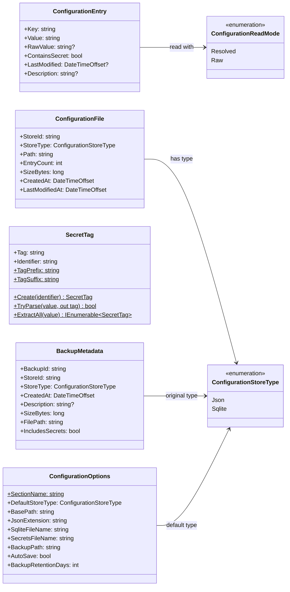
```mermaid
classDiagram
    direction LR
    
    class ConfigurationEntry {
        +Key: string
        +Value: string
        +RawValue: string?
        +ContainsSecret: bool
        +LastModified: DateTimeOffset?
        +Description: string?
    }
    
    class ConfigurationFile {
        +StoreId: string
        +StoreType: ConfigurationStoreType
        +Path: string
        +EntryCount: int
        +SizeBytes: long
        +CreatedAt: DateTimeOffset
        +LastModifiedAt: DateTimeOffset
    }
    
    class SecretTag {
        +Tag: string
        +Identifier: string
        +TagPrefix: string$
        +TagSuffix: string$
        +Create(identifier)$ SecretTag
        +TryParse(value, out tag)$ bool
        +ExtractAll(value)$ IEnumerable~SecretTag~
    }
    
    class BackupMetadata {
        +BackupId: string
        +StoreId: string
        +StoreType: ConfigurationStoreType
        +CreatedAt: DateTimeOffset
        +Description: string?
        +SizeBytes: long
        +FilePath: string
        +IncludesSecrets: bool
    }
    
    class ConfigurationOptions {
        +SectionName: string$
        +DefaultStoreType: ConfigurationStoreType
        +BasePath: string
        +JsonExtension: string
        +SqliteFileName: string
        +SecretsFileName: string
        +BackupPath: string
        +AutoSave: bool
        +BackupRetentionDays: int
    }
    
    class ConfigurationReadMode {
        <<enumeration>>
        Resolved
        Raw
    }
    
    class ConfigurationStoreType {
        <<enumeration>>
        Json
        Sqlite
    }
    
    ConfigurationEntry --> ConfigurationReadMode : read with
    ConfigurationFile --> ConfigurationStoreType : has type
    BackupMetadata --> ConfigurationStoreType : original type
    ConfigurationOptions --> ConfigurationStoreType : default type
```

---

## Data Flow Diagrams

### Secret Resolution Flow

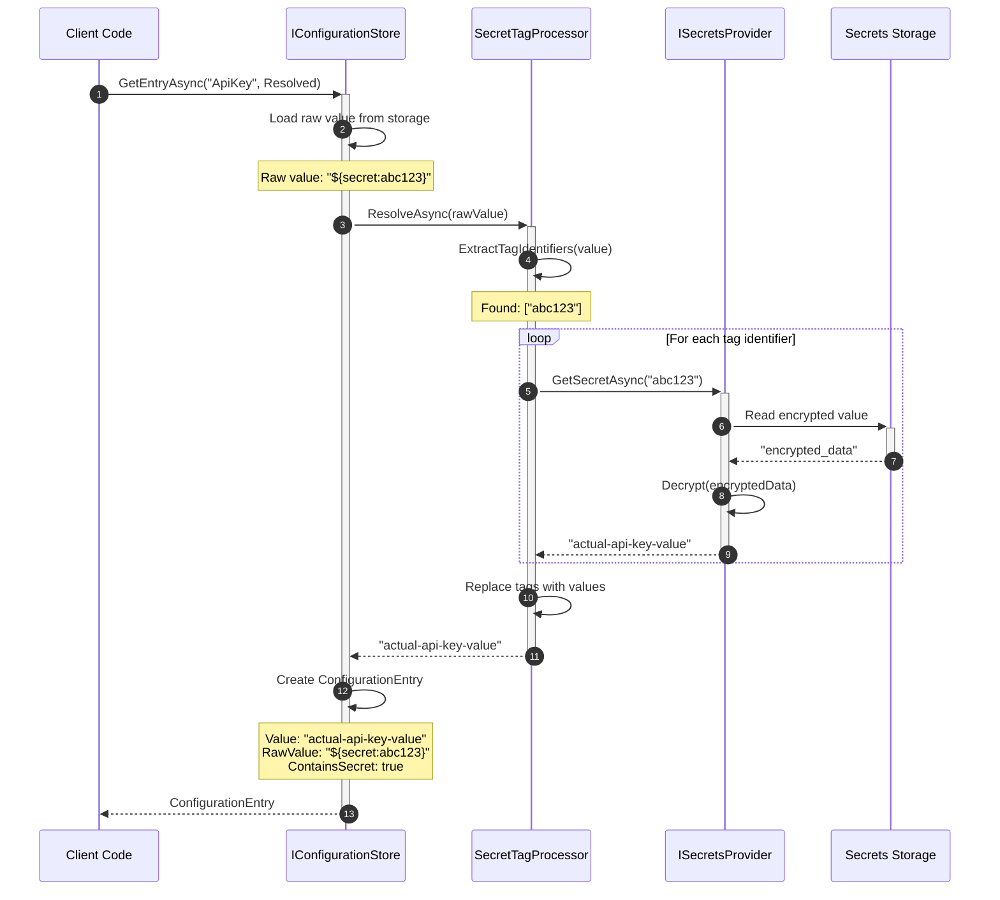
```mermaid
sequenceDiagram
    autonumber
    participant Client as Client Code
    participant Store as IConfigurationStore
    participant Processor as SecretTagProcessor
    participant Provider as ISecretsProvider
    participant Storage as Secrets Storage
    
    Client->>+Store: GetEntryAsync("ApiKey", Resolved)
    Store->>Store: Load raw value from storage
    Note over Store: Raw value: "${secret:abc123}"
    
    Store->>+Processor: ResolveAsync(rawValue)
    Processor->>Processor: ExtractTagIdentifiers(value)
    Note over Processor: Found: ["abc123"]
    
    loop For each tag identifier
        Processor->>+Provider: GetSecretAsync("abc123")
        Provider->>+Storage: Read encrypted value
        Storage-->>-Provider: "encrypted_data"
        Provider->>Provider: Decrypt(encryptedData)
        Provider-->>-Processor: "actual-api-key-value"
    end
    
    Processor->>Processor: Replace tags with values
    Processor-->>-Store: "actual-api-key-value"
    
    Store->>Store: Create ConfigurationEntry
    Note over Store: Value: "actual-api-key-value"<br/>RawValue: "${secret:abc123}"<br/>ContainsSecret: true
    
    Store-->>-Client: ConfigurationEntry
```

### Raw Mode Reading (UI Management)

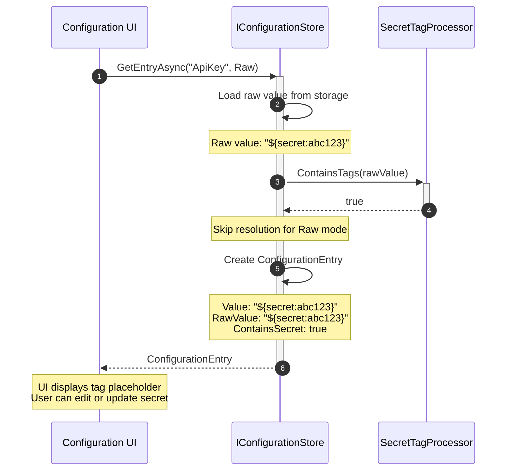
```mermaid
sequenceDiagram
    autonumber
    participant UI as Configuration UI
    participant Store as IConfigurationStore
    participant Processor as SecretTagProcessor
    
    UI->>+Store: GetEntryAsync("ApiKey", Raw)
    Store->>Store: Load raw value from storage
    Note over Store: Raw value: "${secret:abc123}"
    
    Store->>+Processor: ContainsTags(rawValue)
    Processor-->>-Store: true
    
    Note over Store: Skip resolution for Raw mode
    
    Store->>Store: Create ConfigurationEntry
    Note over Store: Value: "${secret:abc123}"<br/>RawValue: "${secret:abc123}"<br/>ContainsSecret: true
    
    Store-->>-UI: ConfigurationEntry
    
    Note over UI: UI displays tag placeholder<br/>User can edit or update secret
```

### Creating a New Secret

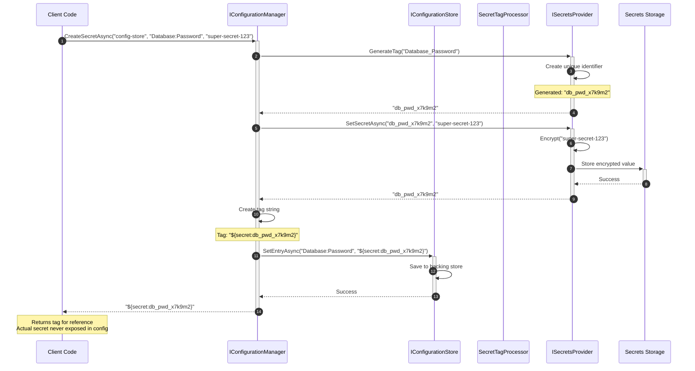
```mermaid
sequenceDiagram
    autonumber
    participant Client as Client Code
    participant Manager as IConfigurationManager
    participant Store as IConfigurationStore
    participant Processor as SecretTagProcessor
    participant Provider as ISecretsProvider
    participant Storage as Secrets Storage
    
    Client->>+Manager: CreateSecretAsync("config-store", "Database:Password", "super-secret-123")
    
    Manager->>+Provider: GenerateTag("Database_Password")
    Provider->>Provider: Create unique identifier
    Note over Provider: Generated: "db_pwd_x7k9m2"
    Provider-->>-Manager: "db_pwd_x7k9m2"
    
    Manager->>+Provider: SetSecretAsync("db_pwd_x7k9m2", "super-secret-123")
    Provider->>Provider: Encrypt("super-secret-123")
    Provider->>+Storage: Store encrypted value
    Storage-->>-Provider: Success
    Provider-->>-Manager: "db_pwd_x7k9m2"
    
    Manager->>Manager: Create tag string
    Note over Manager: Tag: "${secret:db_pwd_x7k9m2}"
    
    Manager->>+Store: SetEntryAsync("Database:Password", "${secret:db_pwd_x7k9m2}")
    Store->>Store: Save to backing store
    Store-->>-Manager: Success
    
    Manager-->>-Client: "${secret:db_pwd_x7k9m2}"
    
    Note over Client: Returns tag for reference<br/>Actual secret never exposed in config
```

### Configuration Loading at Startup

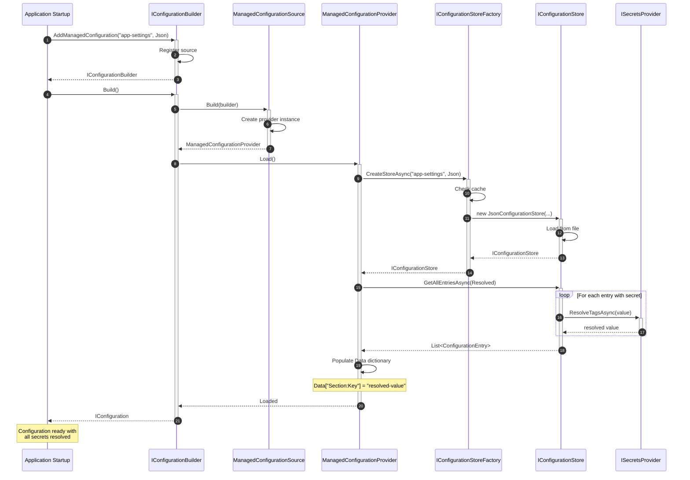
```mermaid
sequenceDiagram
    autonumber
    participant App as Application Startup
    participant Builder as IConfigurationBuilder
    participant Source as ManagedConfigurationSource
    participant Provider as ManagedConfigurationProvider
    participant Factory as IConfigurationStoreFactory
    participant Store as IConfigurationStore
    participant Secrets as ISecretsProvider
    
    App->>+Builder: AddManagedConfiguration("app-settings", Json)
    Builder->>Builder: Register source
    Builder-->>-App: IConfigurationBuilder
    
    App->>+Builder: Build()
    
    Builder->>+Source: Build(builder)
    Source->>Source: Create provider instance
    Source-->>-Builder: ManagedConfigurationProvider
    
    Builder->>+Provider: Load()
    
    Provider->>+Factory: CreateStoreAsync("app-settings", Json)
    Factory->>Factory: Check cache
    Factory->>+Store: new JsonConfigurationStore(...)
    Store->>Store: Load from file
    Store-->>-Factory: IConfigurationStore
    Factory-->>-Provider: IConfigurationStore
    
    Provider->>+Store: GetAllEntriesAsync(Resolved)
    
    loop For each entry with secret
        Store->>+Secrets: ResolveTagsAsync(value)
        Secrets-->>-Store: resolved value
    end
    
    Store-->>-Provider: List<ConfigurationEntry>
    
    Provider->>Provider: Populate Data dictionary
    Note over Provider: Data["Section:Key"] = "resolved-value"
    
    Provider-->>-Builder: Loaded
    
    Builder-->>-App: IConfiguration
    
    Note over App: Configuration ready with<br/>all secrets resolved
```

### Backup and Restore Flow

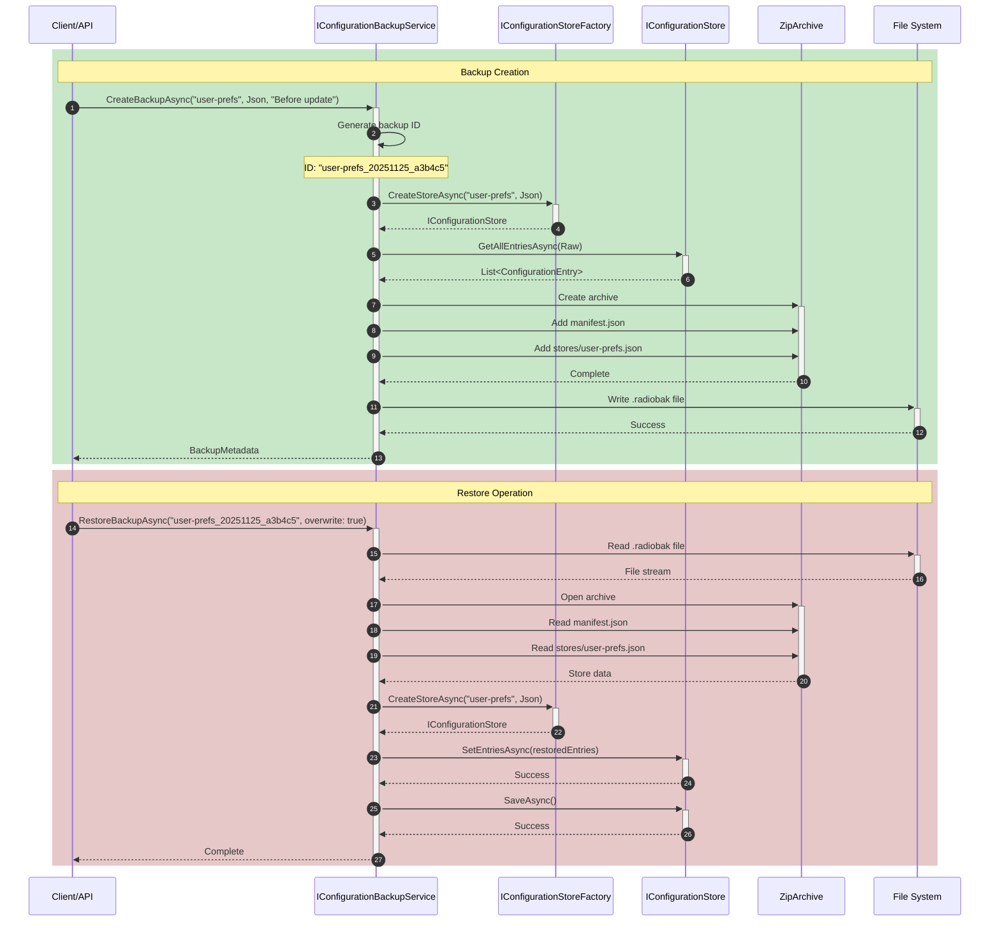
```mermaid
sequenceDiagram
    autonumber
    participant Client as Client/API
    participant Backup as IConfigurationBackupService
    participant Factory as IConfigurationStoreFactory
    participant Store as IConfigurationStore
    participant ZIP as ZipArchive
    participant Disk as File System
    
    rect rgb(200, 230, 200)
        Note over Client,Disk: Backup Creation
        
        Client->>+Backup: CreateBackupAsync("user-prefs", Json, "Before update")
        
        Backup->>Backup: Generate backup ID
        Note over Backup: ID: "user-prefs_20251125_a3b4c5"
        
        Backup->>+Factory: CreateStoreAsync("user-prefs", Json)
        Factory-->>-Backup: IConfigurationStore
        
        Backup->>+Store: GetAllEntriesAsync(Raw)
        Store-->>-Backup: List<ConfigurationEntry>
        
        Backup->>+ZIP: Create archive
        Backup->>ZIP: Add manifest.json
        Backup->>ZIP: Add stores/user-prefs.json
        ZIP-->>-Backup: Complete
        
        Backup->>+Disk: Write .radiobak file
        Disk-->>-Backup: Success
        
        Backup-->>-Client: BackupMetadata
    end
    
    rect rgb(230, 200, 200)
        Note over Client,Disk: Restore Operation
        
        Client->>+Backup: RestoreBackupAsync("user-prefs_20251125_a3b4c5", overwrite: true)
        
        Backup->>+Disk: Read .radiobak file
        Disk-->>-Backup: File stream
        
        Backup->>+ZIP: Open archive
        Backup->>ZIP: Read manifest.json
        Backup->>ZIP: Read stores/user-prefs.json
        ZIP-->>-Backup: Store data
        
        Backup->>+Factory: CreateStoreAsync("user-prefs", Json)
        Factory-->>-Backup: IConfigurationStore
        
        Backup->>+Store: SetEntriesAsync(restoredEntries)
        Store-->>-Backup: Success
        
        Backup->>+Store: SaveAsync()
        Store-->>-Backup: Success
        
        Backup-->>-Client: Complete
    end
```

---

## State Transition Diagrams

### Configuration Store Lifecycle

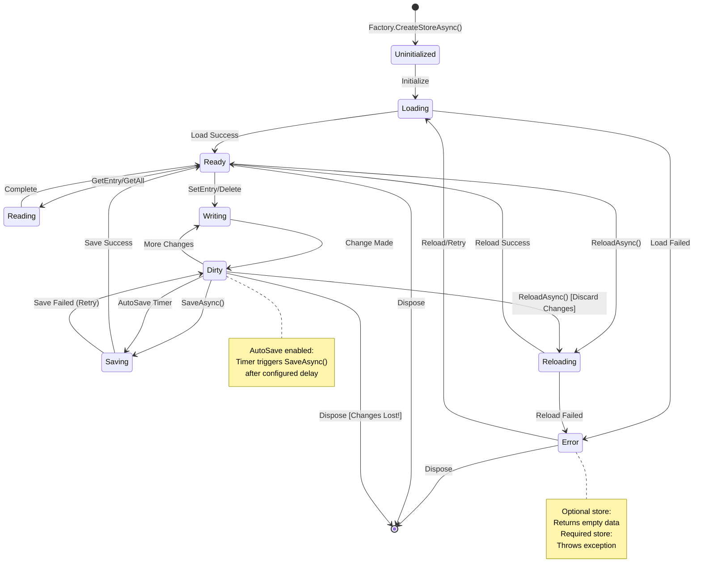
```mermaid
stateDiagram-v2
    [*] --> Uninitialized: Factory.CreateStoreAsync()
    
    Uninitialized --> Loading: Initialize
    Loading --> Ready: Load Success
    Loading --> Error: Load Failed
    
    Error --> Loading: Reload/Retry
    Error --> [*]: Dispose
    
    Ready --> Reading: GetEntry/GetAll
    Reading --> Ready: Complete
    
    Ready --> Writing: SetEntry/Delete
    Writing --> Dirty: Change Made
    Dirty --> Writing: More Changes
    
    Dirty --> Saving: SaveAsync()
    Dirty --> Saving: AutoSave Timer
    Saving --> Ready: Save Success
    Saving --> Dirty: Save Failed (Retry)
    
    Ready --> Reloading: ReloadAsync()
    Dirty --> Reloading: ReloadAsync() [Discard Changes]
    Reloading --> Ready: Reload Success
    Reloading --> Error: Reload Failed
    
    Ready --> [*]: Dispose
    Dirty --> [*]: Dispose [Changes Lost!]
    
    note right of Dirty
        AutoSave enabled: 
        Timer triggers SaveAsync()
        after configured delay
    end note
    
    note right of Error
        Optional store:
        Returns empty data
        Required store:
        Throws exception
    end note
```

### Secret Tag Processing States

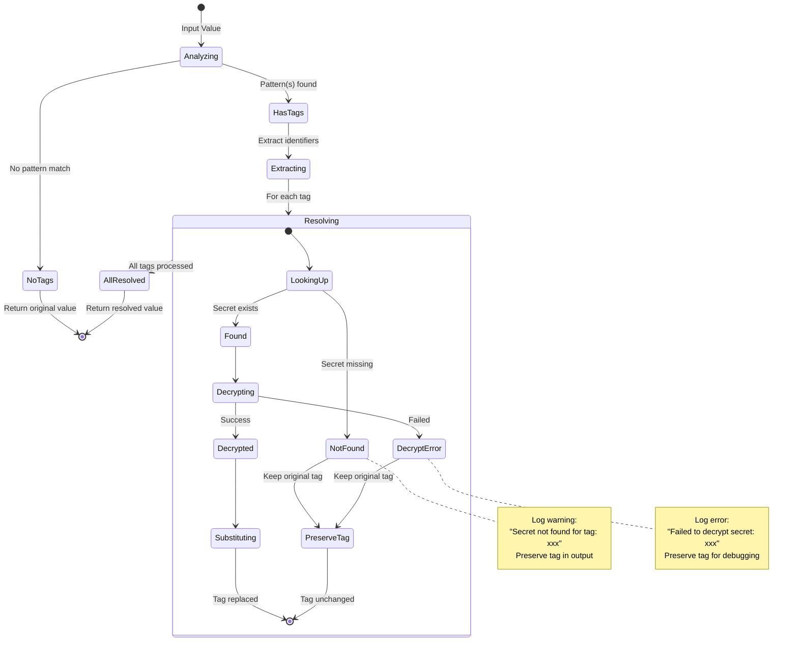
```mermaid
stateDiagram-v2
    [*] --> Analyzing: Input Value
    
    Analyzing --> NoTags: No pattern match
    Analyzing --> HasTags: Pattern(s) found
    
    NoTags --> [*]: Return original value
    
    HasTags --> Extracting: Extract identifiers
    Extracting --> Resolving: For each tag
    
    state Resolving {
        [*] --> LookingUp
        LookingUp --> Found: Secret exists
        LookingUp --> NotFound: Secret missing
        
        Found --> Decrypting
        Decrypting --> Decrypted: Success
        Decrypting --> DecryptError: Failed
        
        NotFound --> PreserveTag: Keep original tag
        DecryptError --> PreserveTag: Keep original tag
        
        Decrypted --> Substituting
        Substituting --> [*]: Tag replaced
        PreserveTag --> [*]: Tag unchanged
    }
    
    Resolving --> AllResolved: All tags processed
    AllResolved --> [*]: Return resolved value
    
    note right of NotFound
        Log warning:
        "Secret not found for tag: xxx"
        Preserve tag in output
    end note
    
    note right of DecryptError
        Log error:
        "Failed to decrypt secret: xxx"
        Preserve tag for debugging
    end note
```

### Backup Lifecycle

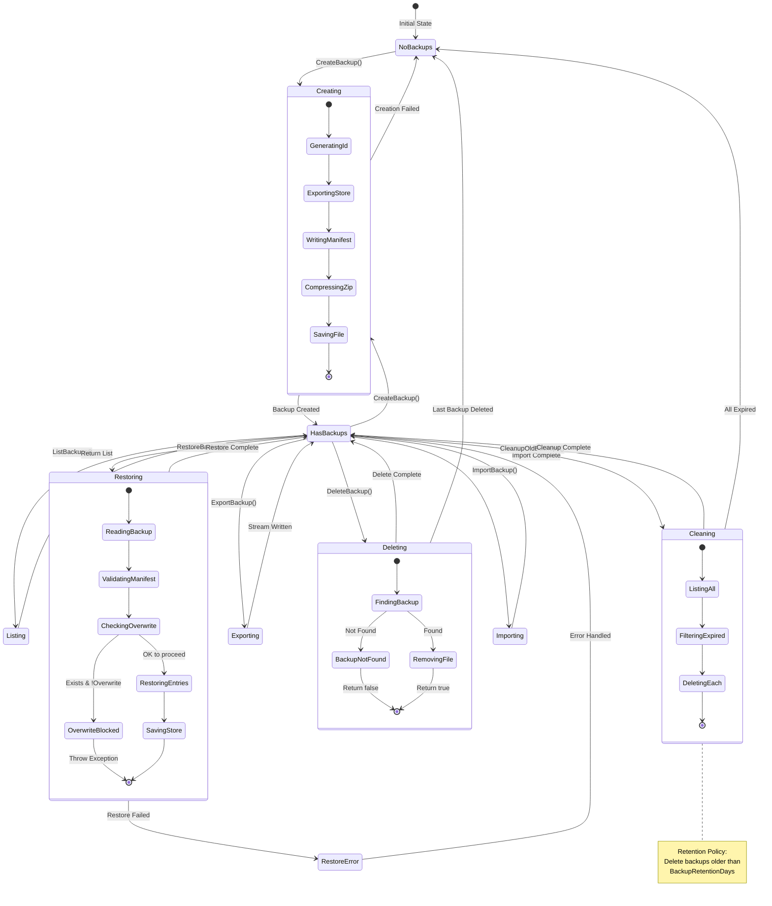
```mermaid
stateDiagram-v2
    [*] --> NoBackups: Initial State
    
    NoBackups --> Creating: CreateBackup()
    
    state Creating {
        [*] --> GeneratingId
        GeneratingId --> ExportingStore
        ExportingStore --> WritingManifest
        WritingManifest --> CompressingZip
        CompressingZip --> SavingFile
        SavingFile --> [*]
    }
    
    Creating --> HasBackups: Backup Created
    Creating --> NoBackups: Creation Failed
    
    HasBackups --> Creating: CreateBackup()
    HasBackups --> Listing: ListBackups()
    HasBackups --> Restoring: RestoreBackup()
    HasBackups --> Exporting: ExportBackup()
    HasBackups --> Deleting: DeleteBackup()
    HasBackups --> Importing: ImportBackup()
    HasBackups --> Cleaning: CleanupOldBackups()
    
    Listing --> HasBackups: Return List
    
    state Restoring {
        [*] --> ReadingBackup
        ReadingBackup --> ValidatingManifest
        ValidatingManifest --> CheckingOverwrite
        CheckingOverwrite --> OverwriteBlocked: Exists & !Overwrite
        CheckingOverwrite --> RestoringEntries: OK to proceed
        OverwriteBlocked --> [*]: Throw Exception
        RestoringEntries --> SavingStore
        SavingStore --> [*]
    }
    
    Restoring --> HasBackups: Restore Complete
    Restoring --> RestoreError: Restore Failed
    RestoreError --> HasBackups: Error Handled
    
    Exporting --> HasBackups: Stream Written
    
    state Deleting {
        [*] --> FindingBackup
        FindingBackup --> BackupNotFound: Not Found
        FindingBackup --> RemovingFile: Found
        BackupNotFound --> [*]: Return false
        RemovingFile --> [*]: Return true
    }
    
    Deleting --> HasBackups: Delete Complete
    Deleting --> NoBackups: Last Backup Deleted
    
    Importing --> HasBackups: Import Complete
    
    state Cleaning {
        [*] --> ListingAll
        ListingAll --> FilteringExpired
        FilteringExpired --> DeletingEach
        DeletingEach --> [*]
    }
    
    Cleaning --> HasBackups: Cleanup Complete
    Cleaning --> NoBackups: All Expired
    
    note right of Cleaning
        Retention Policy:
        Delete backups older than
        BackupRetentionDays
    end note
```

### User Preferences Service State

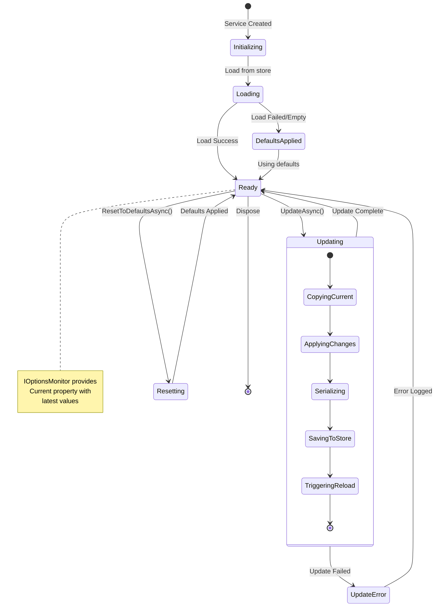
```mermaid
stateDiagram-v2
    [*] --> Initializing: Service Created
    
    Initializing --> Loading: Load from store
    Loading --> Ready: Load Success
    Loading --> DefaultsApplied: Load Failed/Empty
    DefaultsApplied --> Ready: Using defaults
    
    Ready --> Updating: UpdateAsync()
    
    state Updating {
        [*] --> CopyingCurrent
        CopyingCurrent --> ApplyingChanges
        ApplyingChanges --> Serializing
        Serializing --> SavingToStore
        SavingToStore --> TriggeringReload
        TriggeringReload --> [*]
    }
    
    Updating --> Ready: Update Complete
    Updating --> UpdateError: Update Failed
    UpdateError --> Ready: Error Logged
    
    Ready --> Resetting: ResetToDefaultsAsync()
    Resetting --> Ready: Defaults Applied
    
    Ready --> [*]: Dispose
    
    note right of Ready
        IOptionsMonitor provides
        Current property with
        latest values
    end note
```

### Last Run State Service with Auto-Save

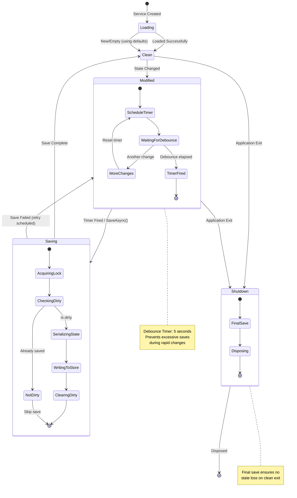
```mermaid
stateDiagram-v2
    [*] --> Loading: Service Created
    
    Loading --> Clean: Loaded Successfully
    Loading --> Clean: New/Empty (using defaults)
    
    Clean --> Modified: State Changed
    
    state Modified {
        [*] --> ScheduleTimer
        ScheduleTimer --> WaitingForDebounce
        WaitingForDebounce --> MoreChanges: Another change
        MoreChanges --> ScheduleTimer: Reset timer
        WaitingForDebounce --> TimerFired: Debounce elapsed
        TimerFired --> [*]
    }
    
    Modified --> Saving: Timer Fired / SaveAsync()
    
    state Saving {
        [*] --> AcquiringLock
        AcquiringLock --> CheckingDirty
        CheckingDirty --> NotDirty: Already saved
        CheckingDirty --> SerializingState: Is dirty
        NotDirty --> [*]: Skip save
        SerializingState --> WritingToStore
        WritingToStore --> ClearingDirty
        ClearingDirty --> [*]
    }
    
    Saving --> Clean: Save Complete
    Saving --> Modified: Save Failed (retry scheduled)
    
    Clean --> Shutdown: Application Exit
    Modified --> Shutdown: Application Exit
    
    state Shutdown {
        [*] --> FinalSave
        FinalSave --> Disposing
        Disposing --> [*]
    }
    
    Shutdown --> [*]: Disposed
    
    note right of Modified
        Debounce Timer: 5 seconds
        Prevents excessive saves
        during rapid changes
    end note
    
    note right of Shutdown
        Final save ensures no
        state loss on clean exit
    end note
```

---

## Folder Structure

```
Radio.Infrastructure/
└── Configuration/
    ├── Abstractions/
    │   ├── IConfigurationStore.cs           # Core store abstraction
    │   ├── IConfigurationStoreFactory.cs    # Factory for creating stores
    │   ├── ISecretsProvider.cs              # Secrets resolution abstraction
    │   ├── IConfigurationBackupService.cs   # Backup/restore abstraction
    │   └── IConfigurationManager.cs         # High-level management interface
    │
    ├── Models/
    │   ├── ConfigurationEntry.cs            # Single key/value with metadata
    │   ├── ConfigurationFile.cs             # Represents a config file/table
    │   ├── ConfigurationReadMode.cs         # Enum: Raw, Resolved
    │   ├── ConfigurationStoreType.cs        # Enum: Json, Sqlite
    │   ├── SecretTag.cs                     # Secret reference tag model
    │   ├── BackupMetadata.cs                # Backup file metadata
    │   └── ConfigurationOptions.cs          # Options pattern configuration
    │
    ├── Stores/
    │   ├── JsonConfigurationStore.cs        # JSON file-based implementation
    │   ├── SqliteConfigurationStore.cs      # SQLite-based implementation
    │   └── ConfigurationStoreFactory.cs     # Factory implementation
    │
    ├── Secrets/
    │   ├── JsonSecretsProvider.cs           # JSON-based secrets storage
    │   ├── SqliteSecretsProvider.cs         # SQLite-based secrets storage
    │   ├── SecretTagProcessor.cs            # Tag detection and substitution
    │   └── SecretsProviderFactory.cs        # Factory for secrets providers
    │
    ├── Backup/
    │   ├── ConfigurationBackupService.cs    # Backup/restore implementation
    │   └── BackupFormat.cs                  # Backup serialization format
    │
    ├── Providers/
    │   ├── ManagedConfigurationProvider.cs  # IConfigurationProvider impl
    │   └── ManagedConfigurationSource.cs    # IConfigurationSource impl
    │
    ├── Services/
    │   ├── ConfigurationManager.cs          # High-level orchestration
    │   ├── UserPreferencesService.cs        # User preferences via IOptions
    │   └── LastRunStateService.cs           # Application state persistence
    │
    ├── Exceptions/
    │   ├── ConfigurationStoreException.cs
    │   ├── ConfigurationEntryNotFoundException.cs
    │   └── ConfigurationStoreCorruptedException.cs
    │
    └── Extensions/
        └── ConfigurationServiceExtensions.cs # DI registration helpers
```

---

## New Configuration Items (Bluetooth)

The following configuration items were added as part of the Bluetooth audio source implementation:

### BluetoothOptions
**Location**: `src/Radio.Core/Configuration/BluetoothOptions.cs`

| Property | Type | Default | Description |
|----------|------|---------|-------------|
| `DeviceName` | string | "Radio Console" | Name advertised to other devices |
| `AutoAcceptConnections` | bool | true | Whether to automatically accept incoming connection requests |
| `RequirePairing` | bool | false | Whether devices must be paired before connecting |
| `EnableOnStartup` | bool | true | Whether to start the Bluetooth service when the application starts |
| `AutoSwitchOnConnect` | bool | true | Whether to switch to Bluetooth source when a device connects |
| `AudioQuality` | Enum | High | Audio stream quality preference (Standard/High) |
| `EnableA2dpSink` | bool | true | Enable Windows AudioPlaybackConnection for A2DP sink (requires build 19041+ and MSIX identity) |
| `EnableMediaSessionMonitoring` | bool | true | Enable Windows SMTC monitoring for AVRCP-equivalent track metadata |
| `EnableLoopbackCapture` | bool | true | Enable WASAPI loopback capture to route BT audio through SoundFlow (Cast, viz, modifiers). Windows only. |

### BluetoothPreferences
**Location**: `src/Radio.Core/Configuration/BluetoothPreferences.cs`

| Property | Type | Default | Description |
|----------|------|---------|-------------|
| `LastConnectedDevice` | string? | null | MAC address of the last connected device |
| `PairedDevices` | List<string> | [] | List of MAC addresses for paired devices |
| `TrustedDevices` | List<string> | [] | List of MAC addresses for trusted devices (auto-connect) |

---

## Web UI Configuration Sections

The System Configuration page (`/system` > Configuration tab) exposes all major configuration sections through a tabbed interface. Each section loads from and saves to the configuration store via the API.

| Tab | API Section | Options Class | Description |
|-----|-------------|---------------|-------------|
| Audio | `audio` | `AudioOptions` | Ducking, default source |
| Audio Engine | `audioengine` | `AudioEngineOptions` | Sample rate, buffer size, channels (restart required) |
| Radio | `radio` | `RadioOptions` | Frequencies, bands, scan settings, device volume |
| Bluetooth | `bluetooth` | `BluetoothOptions` | Device name, auto-start, pairing, audio quality |
| File Player | `fileplayer` | `FilePlayerOptions` | Root directory, supported extensions |
| TTS | `tts` | `TTSOptions` | Default engine/voice, pitch, speed, timeout |
| Fingerprinting | `fingerprinting` | `FingerprintingOptions` | Intervals, thresholds, fpcalc path (API keys in Secrets tab) |
| Metrics | `metrics` | `MetricsOptions` | Flush interval, retention periods, rollup |
| Visualizer | `visualizer` | `VisualizerOptions` | FFT size, smoothing, peak hold |
| Output | `output` | `OutputOptions` | Local, HTTP stream, Google Cast output settings |
| Devices | `devices` | `DeviceOptions` | USB port paths for hardware devices |

### RadioOptions
**Location**: `src/Radio.Core/Configuration/RadioOptions.cs`

| Property | Type | Default | Description |
|----------|------|---------|-------------|
| `DefaultDevice` | string | "RTLSDRCore" | Radio hardware backend ("RTLSDRCore" or "RF320") |
| `DefaultFMFrequencyMHz` | double | 101.5 | Startup FM frequency |
| `DefaultAMFrequencyKHz` | double | 1000.0 | Startup AM frequency |
| `DefaultFMStepMHz` | double | 0.1 | FM tuning step size |
| `DefaultAMStepKHz` | double | 10.0 | AM tuning step size |
| `MinFMFrequencyMHz` | double | 87.5 | Lower FM band limit |
| `MaxFMFrequencyMHz` | double | 108.0 | Upper FM band limit |
| `MinAMFrequencyKHz` | double | 520.0 | Lower AM band limit |
| `MaxAMFrequencyKHz` | double | 1710.0 | Upper AM band limit |
| `ScanStopThreshold` | int | 50 | Signal strength to stop scan |
| `ScanStepDelayMs` | int | 100 | Delay between scan steps |
| `DefaultDeviceVolume` | int | 50 | Radio hardware volume (0-100) |

### FilePlayerOptions
**Location**: `src/Radio.Core/Configuration/FilePlayerOptions.cs`

| Property | Type | Default | Description |
|----------|------|---------|-------------|
| `RootDirectory` | string | "media/audio" | Root path for music library |
| `SupportedExtensions` | string[] | [".mp3",".flac",".wav",".ogg",".aac",".m4a",".wma"] | File extensions to include |

### FingerprintingOptions
**Location**: `src/Radio.Core/Configuration/FingerprintingOptions.cs`

| Property | Type | Default | Description |
|----------|------|---------|-------------|
| `Enabled` | bool | true | Enable audio fingerprinting |
| `SampleDurationSeconds` | int | 15 | Audio sample length for fingerprinting |
| `IdentificationIntervalSeconds` | int | 30 | Time between identification attempts |
| `MinimumConfidenceThreshold` | double | 0.5 | Minimum match confidence (0.0-1.0) |
| `DuplicateSuppressionMinutes` | int | 5 | Ignore re-identification within this window |
| `FpcalcPath` | string | "" | Path to fpcalc binary (blank = auto-detect) |
| `DatabasePath` | string | "./data/fingerprints.db" | Path to fingerprinting database |
| `AcoustId` | AcoustIdOptions | (nested) | AcoustID API settings (key in Secrets) |
| `MusicBrainz` | MusicBrainzOptions | (nested) | MusicBrainz API settings |

### TTSOptions
**Location**: `src/Radio.Core/Configuration/TTSOptions.cs`

| Property | Type | Default | Description |
|----------|------|---------|-------------|
| `DefaultEngine` | string | "ESpeak" | TTS engine ("ESpeak", "Google", "Azure") |
| `DefaultVoice` | string | "en" | Default voice ID |
| `DefaultPitch` | float | 1.0 | Default pitch (0.5-2.0) |
| `DefaultSpeed` | float | 1.0 | Default speed (0.5-2.0) |
| `ESpeakPath` | string | "espeak-ng" | Path to espeak-ng binary |
| `GenerationTimeoutSeconds` | int | 30 | Max time for TTS generation |

### MetricsOptions
**Location**: `src/Radio.Core/Configuration/MetricsOptions.cs`

| Property | Type | Default | Description |
|----------|------|---------|-------------|
| `Enabled` | bool | true | Enable metrics collection |
| `FlushIntervalSeconds` | int | 60 | How often metrics are flushed to DB |
| `DatabasePath` | string | "./data/metrics.db" | Path to metrics database |
| `RetentionMinuteData` | int | 120 | Minute-level data retention (minutes) |
| `RetentionHourData` | int | 48 | Hour-level data retention (hours) |
| `RetentionDayData` | int | 365 | Day-level data retention (days) |
| `RollupIntervalMinutes` | int | 60 | How often rollups are computed |

### AudioEngineOptions
**Location**: `src/Radio.Core/Configuration/AudioEngineOptions.cs`

| Property | Type | Default | Description |
|----------|------|---------|-------------|
| `SampleRate` | int | 48000 | Audio sample rate (Hz) |
| `Channels` | int | 2 | Audio channel count |
| `BufferSize` | int | 1024 | Audio buffer size (samples) |
| `HotPlugIntervalSeconds` | int | 5 | Device detection interval |
| `OutputBufferSizeSeconds` | int | 5 | Output buffer size in seconds |
| `EnableHotPlugDetection` | bool | true | Enable audio device hot-plug detection |
